# AWS Webserver

Setting up the web server was very quick

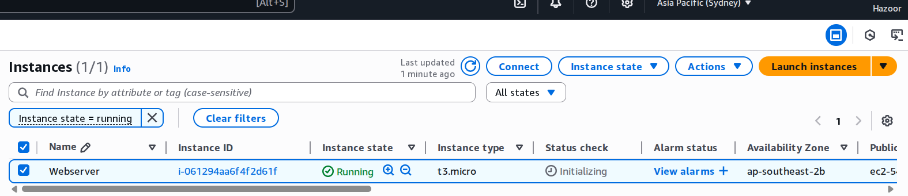

Security groups were in the set up process which made things very simple, just selection

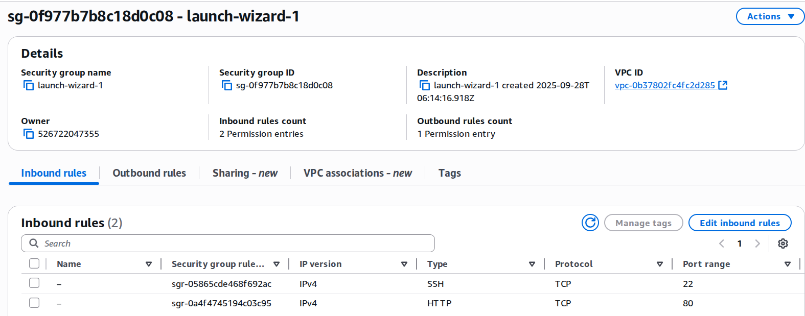

Failed connection due to wrong permissions

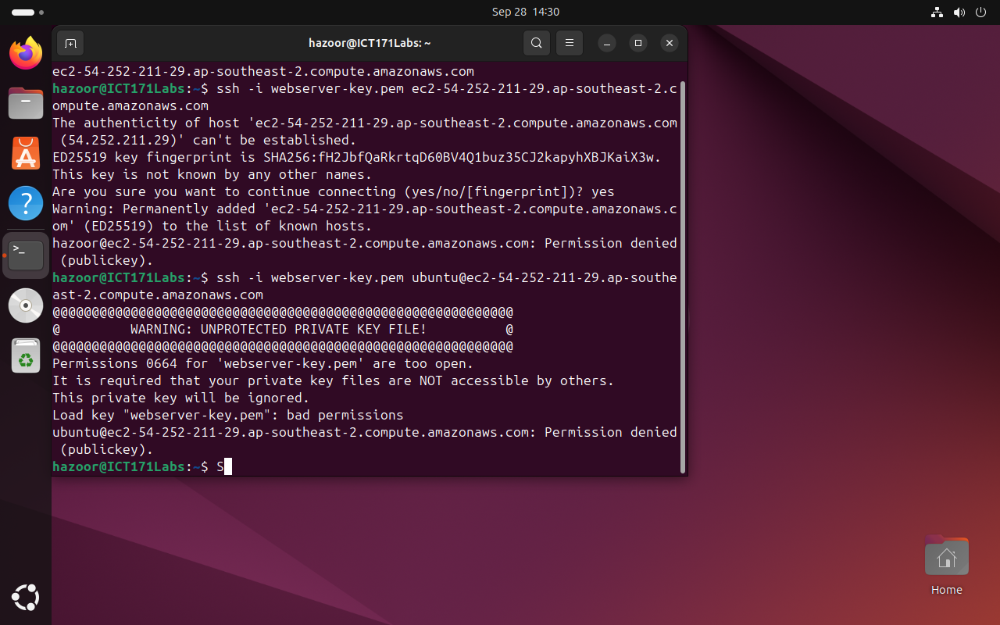

Rectified the permissions for the key & successfully connected

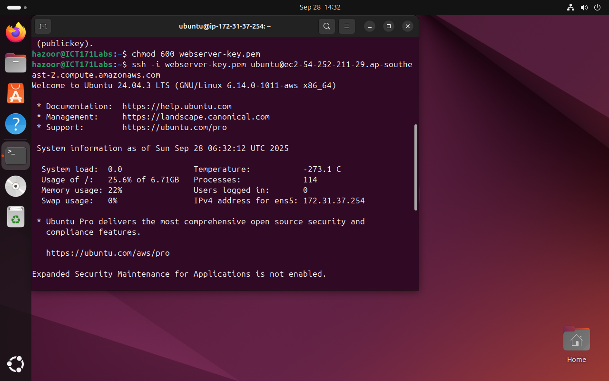

Apache was easily installed and run due to the initial security groups

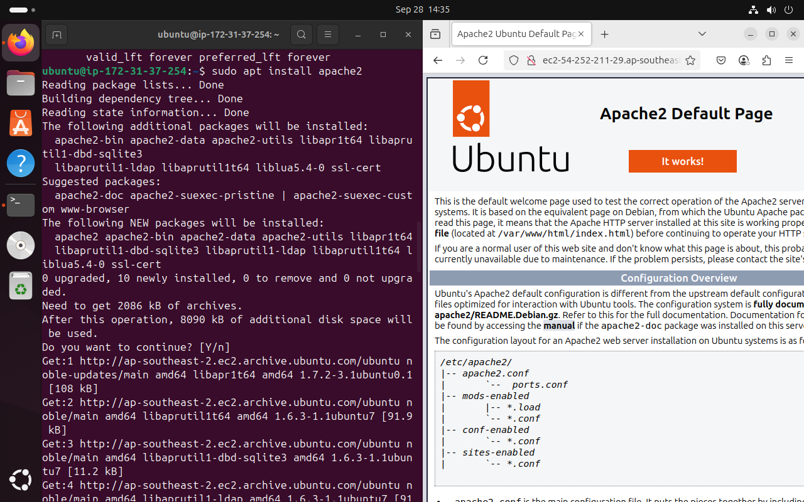

Similarly, inputting a [custom HTML file](./Additional Files/custom_index.html) was simple.

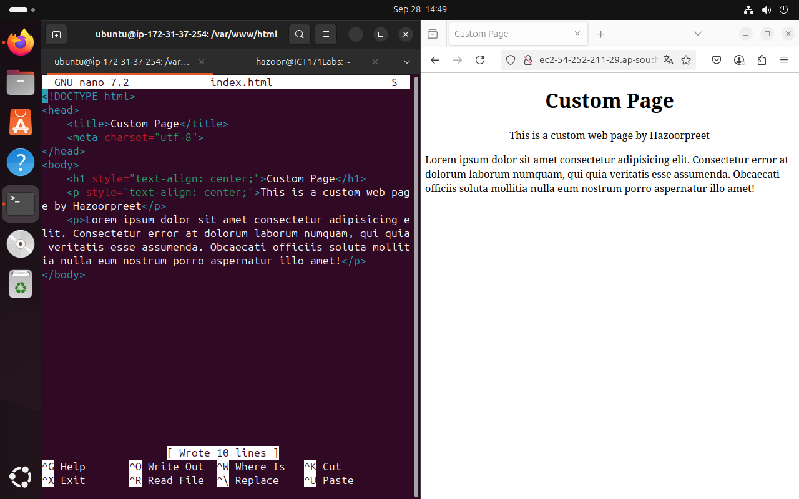

I was easily able to download, moved, and view a PDF using the public ip address from the internet archive

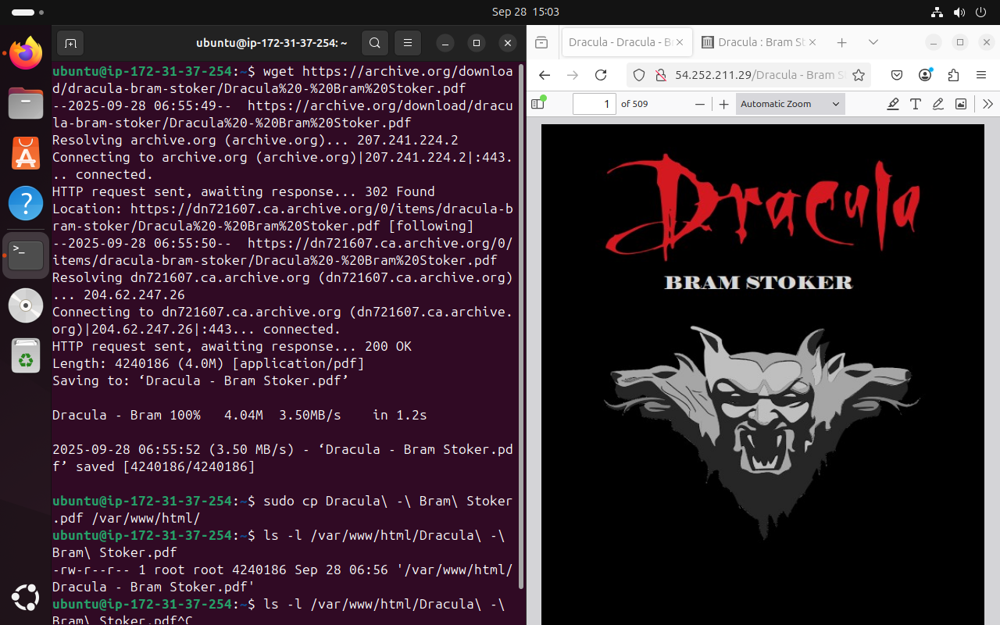

I proceeded to add a link to the PDF to the main page

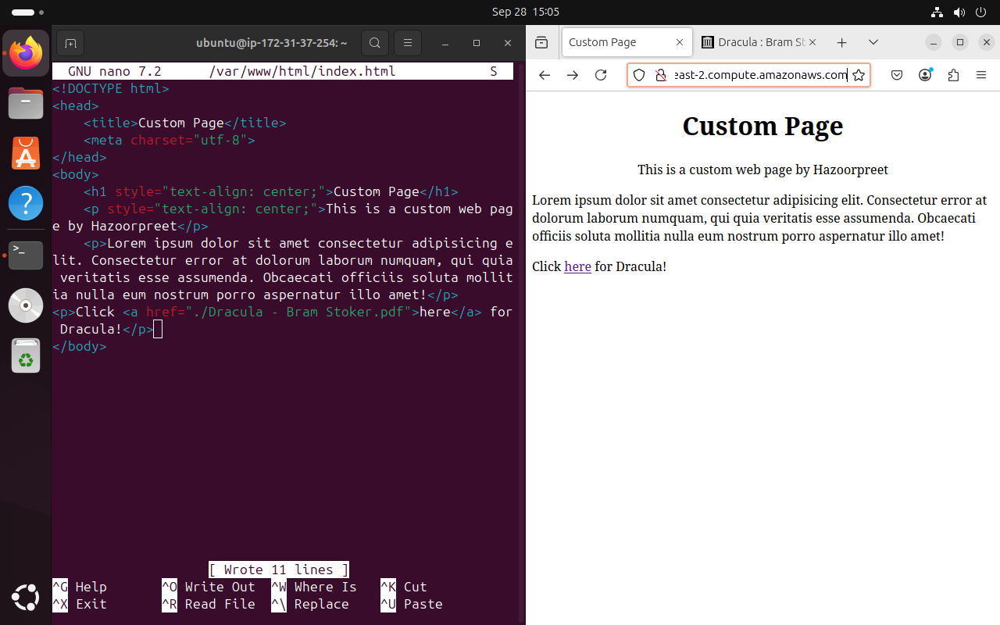

I easily and quickly created a budget alert for my free tier

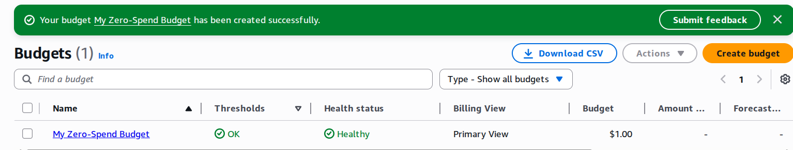

I attempted and succeeded in copying a file using SCP.

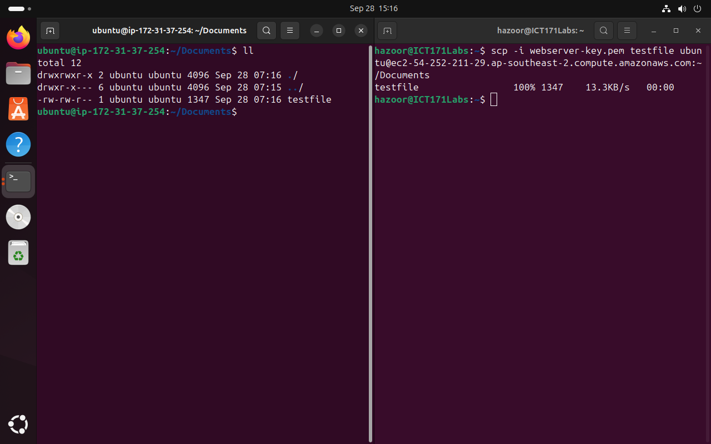

I tried pinging different countries' servers from the IP Address (gathered from Mullvad VPN's site). Namely USA, Thailand, and Spain (in this respective order) and found Thailand to have the lowest latency and Spain to have the highest latency.

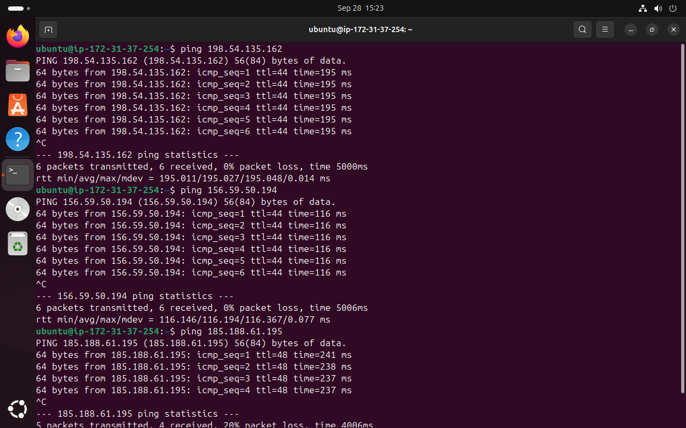

After usage, the Webserver was stopped as to avoid wasting money.

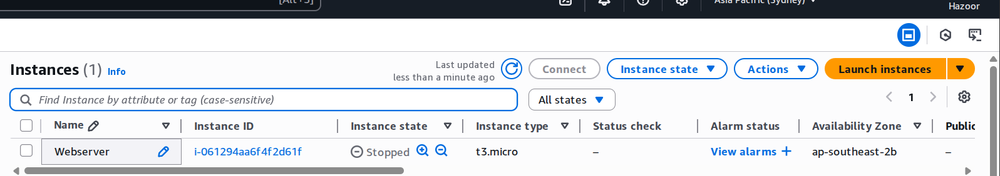

System was terminated once it became unnecessary entirely.

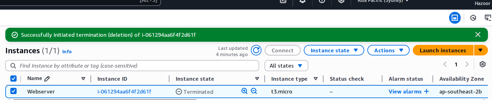

## Reflections

- How does cloud hosting compare to local hosting?
    - Cloud computing provides resources as needed, allowing for easy scale-up and scale-down along with greater access to more locations for mirroring.
    - Local hosting can be preferable as long as the system usage is largely consistent, maintainable, and labor costs are not too high.
- What would you need to secure this server?
    - Firewall and updates are required to keep any exposed servers protected. Additionally, DDoS protection from a service like Cloudflare can keep prices from going too high.
- What alternatives to EC2 would you consider and why?
    - Azure, Google Cloud, and DigitalOcean are good alternatives for hosting. For webserver specific usage, many domain providers also have options for hosting directly from the domain provider.
- What did you learn about file ownership and permissions?
    - Folder owners need write privilege to move items into them.
- What risks are associated with leaving instances running?
    - Many instances have occured of cost overruns by developers who forgot to cap their server resources.
- How would you explain the difference between DNS and /etc/hosts to a client?
    - DNS & /etc/hosts both provide friendly names for connecting to IP Addresses. DNS is web based and allows for multiple computers to agree on the same friendly names, however /etc/hosts will always only apply to one's own machine unless copied to another.
