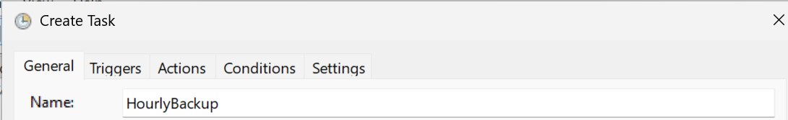
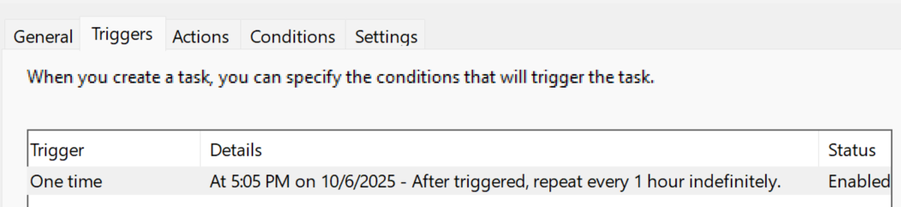
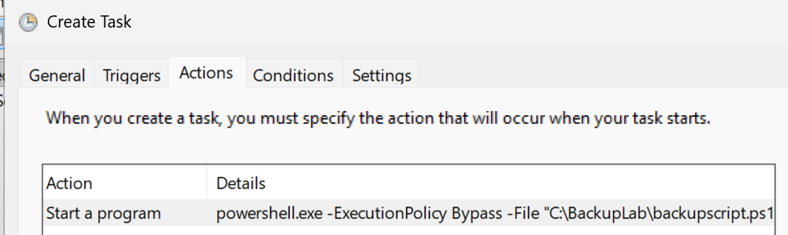
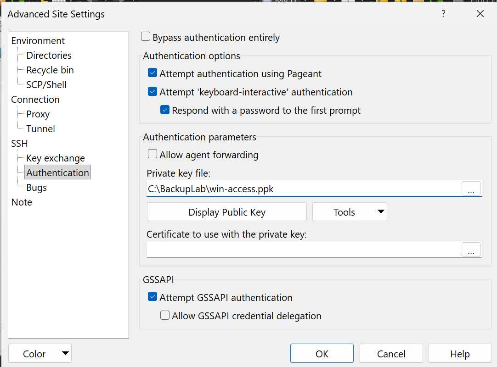
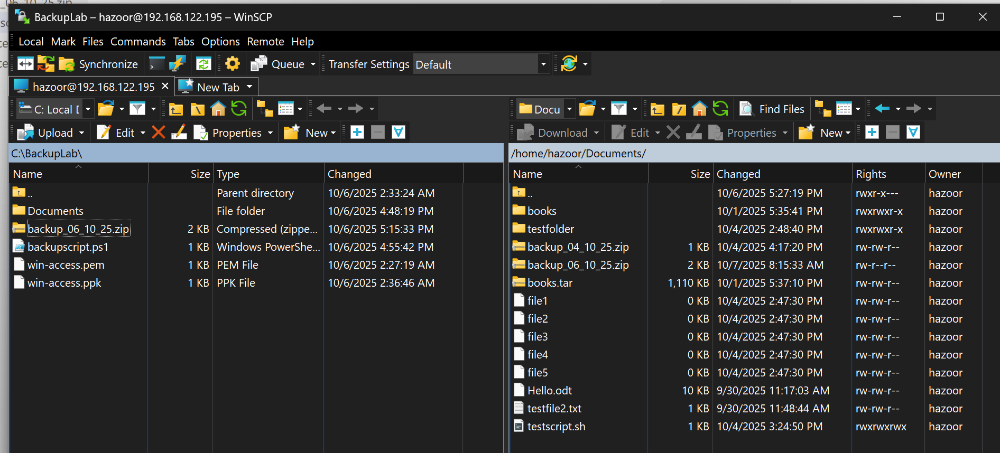

# Backup Scripting

## Scripting Linux Server Functions

I started by testing a basic script to echo some text
```
hazoor@ICT171Labs:~$ nano script.sh
hazoor@ICT171Labs:~$ cat script.sh 
#!/bin/bash
echo "Hello, World of Bash!"
hazoor@ICT171Labs:~$ chmod 744 script.sh 
hazoor@ICT171Labs:~$ ./script.sh 
Hello, World of Bash!
```

I altered this script to test out variables. This was simple to understand, though a little odd with having to use $ to reference them, very unlike most programming languages such as python. It honestly seems like the opposite, where functions and executable are the default and variables are second-class, explicitly having to declare their use.
```
hazoor@ICT171Labs:~$ nano ./script.sh 
hazoor@ICT171Labs:~$ cat ./script.sh 
#!/bin/bash
message="Hello World, from Variable!"
echo $message
hazoor@ICT171Labs:~$ ./script.sh 
Hello World, from Variable!
```

I altered it again to do some calculations using variables. The syntax is still a little awkward due to my experience with programming languages.
```
hazoor@ICT171Labs:~$ nano script.sh 
hazoor@ICT171Labs:~$ cat script.sh 
#!/bin/bash
a=37
b=5
c=$((a+b))
echo $c
hazoor@ICT171Labs:~$ ./script.sh 
42
```

I attempted a for loop, found it to be very similar to c-style for loops. Likely due to the POSIX standards for shells originating with Unix which was itself written in C.
```
hazoor@ICT171Labs:~$ nano script.sh 
hazoor@ICT171Labs:~$ cat script.sh 
#!/bin/bash
for ((i=0;i<10;i++)); 
do 
  echo $i
done
hazoor@ICT171Labs:~$ ./script.sh 
0
1
2
3
4
5
6
7
8
9
```

I created my workspace using `mkdir`, `touch`, and number ranges with bash.
```
hazoor@ICT171Labs:~$ mkdir -p ~/Documents/testfolder
hazoor@ICT171Labs:~$ cd Documents/
hazoor@ICT171Labs:~/Documents$ touch file{1..5}
hazoor@ICT171Labs:~/Documents$ touch testfolder/file{11..55..11}
hazoor@ICT171Labs:~/Documents$ ls -R
.:
books      file1  file3  file5      testfile2.txt
books.tar  file2  file4  Hello.odt  testfolder

./books:
12-0.txt  36-0.txt  76-0.txt

./testfolder:
file11  file22  file33  file44  file55
```

I setup the base of the testscript.sh file and ran it to test
```
hazoor@ICT171Labs:~/Documents$ cat testscript.sh 
#!/bin/bash
echo "Backup script initiated."
hazoor@ICT171Labs:~/Documents$ chmod 777 testscript.sh 
hazoor@ICT171Labs:~/Documents$ ./testscript.sh 
Backup script initiated.
```

A date counter was added to print the date of the backup
```
hazoor@ICT171Labs:~/Documents$ nano testscript.sh 
hazoor@ICT171Labs:~/Documents$ cat testscript.sh 
#!/bin/bash
echo "Backup script initiated."
now=$(date +"%d_%m_%y")
echo "Today's date is $now"
hazoor@ICT171Labs:~/Documents$ ./testscript.sh 
Backup script initiated.
Today's date is 04_10_25
```

This script was then made to move the files into a directory, then a backup archive by adding the following two lines. I made sure to create the backup directory so nothing would go wrong.
```
cp -R /home/hazoor/Documents /home/hazoor/backup/
zip -r "/home/hazoor/backup.zip" /home/hazoor/backup/
```
I tested it and checked with ls to make sure the backup file was successfully created
```
hazoor@ICT171Labs:~/Documents$ ./testscript.sh 
Backup script initiated.
Today's date is 04_10_25
  adding: home/hazoor/backup/ (stored 0%)
  adding: home/hazoor/backup/Documents/ (stored 0%)
  adding: home/hazoor/backup/Documents/Hello.odt (deflated 20%)
  adding: home/hazoor/backup/Documents/file1 (stored 0%)
  adding: home/hazoor/backup/Documents/testfolder/ (stored 0%)
  adding: home/hazoor/backup/Documents/testfolder/file33 (stored 0%)
  adding: home/hazoor/backup/Documents/testfolder/file22 (stored 0%)
  adding: home/hazoor/backup/Documents/testfolder/file44 (stored 0%)
  adding: home/hazoor/backup/Documents/testfolder/file11 (stored 0%)
  adding: home/hazoor/backup/Documents/testfolder/file55 (stored 0%)
  adding: home/hazoor/backup/Documents/file2 (stored 0%)
  adding: home/hazoor/backup/Documents/file3 (stored 0%)
  adding: home/hazoor/backup/Documents/books.tar (deflated 63%)
  adding: home/hazoor/backup/Documents/file5 (stored 0%)
  adding: home/hazoor/backup/Documents/books/ (stored 0%)
  adding: home/hazoor/backup/Documents/books/12-0.txt (deflated 64%)
  adding: home/hazoor/backup/Documents/books/76-0.txt (deflated 63%)
  adding: home/hazoor/backup/Documents/books/36-0.txt (deflated 62%)
  adding: home/hazoor/backup/Documents/testscript.sh (deflated 33%)
  adding: home/hazoor/backup/Documents/testfile2.txt (stored 0%)
  adding: home/hazoor/backup/Documents/file4 (stored 0%)
hazoor@ICT171Labs:~/Documents$ ls ~/backup.zip
/home/hazoor/backup.zip
```

This backup would have to be by date so the following line was added to make sure the backup file was moved to a file including the date in the name.
```
mv /home/hazoor/backup.zip /home/hazoor/backup_$now.zip
```
I once again tested and found the backup file to now include the date.
```
hazoor@ICT171Labs:~/Documents$ ./testscript.sh 
Backup script initiated.
Today's date is 04_10_25
updating: home/hazoor/backup/ (stored 0%)
updating: home/hazoor/backup/Documents/ (stored 0%)
updating: home/hazoor/backup/Documents/Hello.odt (deflated 20%)
updating: home/hazoor/backup/Documents/file1 (stored 0%)
updating: home/hazoor/backup/Documents/testfolder/ (stored 0%)
updating: home/hazoor/backup/Documents/testfolder/file33 (stored 0%)
updating: home/hazoor/backup/Documents/testfolder/file22 (stored 0%)
updating: home/hazoor/backup/Documents/testfolder/file44 (stored 0%)
updating: home/hazoor/backup/Documents/testfolder/file11 (stored 0%)
updating: home/hazoor/backup/Documents/testfolder/file55 (stored 0%)
updating: home/hazoor/backup/Documents/file2 (stored 0%)
updating: home/hazoor/backup/Documents/file3 (stored 0%)
updating: home/hazoor/backup/Documents/books.tar (deflated 63%)
updating: home/hazoor/backup/Documents/file5 (stored 0%)
updating: home/hazoor/backup/Documents/books/ (stored 0%)
updating: home/hazoor/backup/Documents/books/12-0.txt (deflated 64%)
updating: home/hazoor/backup/Documents/books/76-0.txt (deflated 63%)
updating: home/hazoor/backup/Documents/books/36-0.txt (deflated 62%)
updating: home/hazoor/backup/Documents/testscript.sh (deflated 44%)
updating: home/hazoor/backup/Documents/testfile2.txt (stored 0%)
updating: home/hazoor/backup/Documents/file4 (stored 0%)
hazoor@ICT171Labs:~/Documents$ ls -l ~/backup_04_10_25.zip 
-rw-rw-r-- 1 hazoor hazoor 852068 Oct  4 15:08 /home/hazoor/backup_04_10_25.zip
```

Now, before I made this script globally executable, I needed to make some alterations to make sure it would not only work for my own account. I replaced every instance of `/home/hazoor` with `$HOME` so it would automatically select the running user's home directory from its absolute path. I also added creation/destruction commands for the `backup` directory, resulting in the following script:
```bash
#!/bin/bash

# Start script
echo "Backup script initiated."

# Store & print current date
now=$(date +"%d_%m_%y")
echo "Today's date is $now"

# Archive files
mkdir $HOME/backup
cp -R $HOME/Documents $HOME/backup/
zip -r "$HOME/backup.zip" $HOME/backup/
rm -rf $HOME/backup

# Rename Archive
mv $HOME/backup.zip $HOME/backup_$now.zip
```

I proceeded to copy the amended script over to the /usr/bin directory and made sure to take ownership of it.
```
hazoor@ICT171Labs:~/Documents$ sudo cp testscript.sh /usr/bin/testscript
hazoor@ICT171Labs:~/Documents$ sudo chown hazoor /usr/bin/testscript
hazoor@ICT171Labs:~/Documents$ ls -l /usr/bin/testscript 
-rwxr-xr-x 1 hazoor root 306 Oct  4 15:25 /usr/bin/testscript
```
I removed the original backup file and ran it again from another directory to test. It ran successfully without any issues.
```
hazoor@ICT171Labs:~$ rm backup_04_10_25.zip 
hazoor@ICT171Labs:~$ cd /var/lib/
hazoor@ICT171Labs:/var/lib$ testscript 
Backup script initiated.
Today's date is 04_10_25
  adding: home/hazoor/backup/ (stored 0%)
  adding: home/hazoor/backup/Documents/ (stored 0%)
  adding: home/hazoor/backup/Documents/Hello.odt (deflated 20%)
  adding: home/hazoor/backup/Documents/file1 (stored 0%)
  adding: home/hazoor/backup/Documents/testfolder/ (stored 0%)
  adding: home/hazoor/backup/Documents/testfolder/file33 (stored 0%)
  adding: home/hazoor/backup/Documents/testfolder/file22 (stored 0%)
  adding: home/hazoor/backup/Documents/testfolder/file44 (stored 0%)
  adding: home/hazoor/backup/Documents/testfolder/file11 (stored 0%)
  adding: home/hazoor/backup/Documents/testfolder/file55 (stored 0%)
  adding: home/hazoor/backup/Documents/file2 (stored 0%)
  adding: home/hazoor/backup/Documents/file3 (stored 0%)
  adding: home/hazoor/backup/Documents/books.tar (deflated 63%)
  adding: home/hazoor/backup/Documents/file5 (stored 0%)
  adding: home/hazoor/backup/Documents/books/ (stored 0%)
  adding: home/hazoor/backup/Documents/books/12-0.txt (deflated 64%)
  adding: home/hazoor/backup/Documents/books/76-0.txt (deflated 63%)
  adding: home/hazoor/backup/Documents/books/36-0.txt (deflated 62%)
  adding: home/hazoor/backup/Documents/testscript.sh (deflated 34%)
  adding: home/hazoor/backup/Documents/testfile2.txt (stored 0%)
  adding: home/hazoor/backup/Documents/file4 (stored 0%)
hazoor@ICT171Labs:/var/lib$ ls ~
backup_04_10_25.zip  Documents               Music      Templates
books                Downloads               Pictures   Videos
books.tar            hello_world.c           Public     webserver-key.pem
custom_index.html    hello_world_executable  script.sh
Desktop              LabFiles                snap
```

I set the command to run every hour by editing the crontab.
```
SHELL=/bin/sh
# You can also override PATH, but by default, newer versions inherit it from the environment
#PATH=/usr/local/sbin:/usr/local/bin:/usr/sbin:/usr/bin:/sbin:/bin

# Example of job definition:
# .---------------- minute (0 - 59)
# |  .------------- hour (0 - 23)
# |  |  .---------- day of month (1 - 31)
# |  |  |  .------- month (1 - 12) OR jan,feb,mar,apr ...
# |  |  |  |  .---- day of week (0 - 6) (Sunday=0 or 7) OR sun,mon,tue,wed,thu,fri,sat
# |  |  |  |  |
# *  *  *  *  * user-name command to be executed
17 *	* * *	root	cd / && run-parts --report /etc/cron.hourly
25 6	* * *	root	test -x /usr/sbin/anacron || { cd / && run-parts --report /etc/cron.daily; }
47 6	* * 7	root	test -x /usr/sbin/anacron || { cd / && run-parts --report /etc/cron.weekly; }
52 6	1 * *	root	test -x /usr/sbin/anacron || { cd / && run-parts --report /etc/cron.monthly; }
36 *    * * *   hazoor  /usr/bin/testscript >> /home/hazoor/logs/backup_task.log
#
```

I created the log directory in my home folder and sure enough, at the 36th minute of the hour, received the logs.
```
hazoor@ICT171Labs:~$ mkdir logs
hazoor@ICT171Labs:~$ cat ~/logs/backup_task.log 
Backup script initiated.
Today's date is 04_10_25
  adding: home/hazoor/backup/ (stored 0%)
  adding: home/hazoor/backup/Documents/ (stored 0%)
  adding: home/hazoor/backup/Documents/Hello.odt (deflated 20%)
  adding: home/hazoor/backup/Documents/file1 (stored 0%)
  adding: home/hazoor/backup/Documents/testfolder/ (stored 0%)
  adding: home/hazoor/backup/Documents/testfolder/file33 (stored 0%)
  adding: home/hazoor/backup/Documents/testfolder/file22 (stored 0%)
  adding: home/hazoor/backup/Documents/testfolder/file44 (stored 0%)
  adding: home/hazoor/backup/Documents/testfolder/file11 (stored 0%)
  adding: home/hazoor/backup/Documents/testfolder/file55 (stored 0%)
  adding: home/hazoor/backup/Documents/file2 (stored 0%)
  adding: home/hazoor/backup/Documents/file3 (stored 0%)
  adding: home/hazoor/backup/Documents/books.tar (deflated 63%)
  adding: home/hazoor/backup/Documents/file5 (stored 0%)
  adding: home/hazoor/backup/Documents/books/ (stored 0%)
  adding: home/hazoor/backup/Documents/books/12-0.txt (deflated 64%)
  adding: home/hazoor/backup/Documents/books/76-0.txt (deflated 63%)
  adding: home/hazoor/backup/Documents/books/36-0.txt (deflated 62%)
  adding: home/hazoor/backup/Documents/testscript.sh (deflated 34%)
  adding: home/hazoor/backup/Documents/testfile2.txt (stored 0%)
  adding: home/hazoor/backup/Documents/file4 (stored 0%)
hazoor@ICT171Labs:~$ 
```

I adjusted the script again, adding one more line to upload files to a remote server.
```
scp -i "HTTPS Web Server.pem" $HOME/backup_$now.zip ubuntu@13.239.112.95:/home/ubuntu/backups
```
I made sure the ssh into the server first, then proceeded to run the script locally. It seemed to successfully transfer.
```
hazoor@ICT171Labs:~$ testscript
Backup script initiated.
Today's date is 04_10_25
  adding: home/hazoor/backup/ (stored 0%)
  adding: home/hazoor/backup/Documents/ (stored 0%)
  adding: home/hazoor/backup/Documents/Hello.odt (deflated 20%)
  adding: home/hazoor/backup/Documents/file1 (stored 0%)
  adding: home/hazoor/backup/Documents/testfolder/ (stored 0%)
  adding: home/hazoor/backup/Documents/testfolder/file33 (stored 0%)
  adding: home/hazoor/backup/Documents/testfolder/file22 (stored 0%)
  adding: home/hazoor/backup/Documents/testfolder/file44 (stored 0%)
  adding: home/hazoor/backup/Documents/testfolder/file11 (stored 0%)
  adding: home/hazoor/backup/Documents/testfolder/file55 (stored 0%)
  adding: home/hazoor/backup/Documents/file2 (stored 0%)
  adding: home/hazoor/backup/Documents/file3 (stored 0%)
  adding: home/hazoor/backup/Documents/books.tar (deflated 63%)
  adding: home/hazoor/backup/Documents/file5 (stored 0%)
  adding: home/hazoor/backup/Documents/books/ (stored 0%)
  adding: home/hazoor/backup/Documents/books/12-0.txt (deflated 64%)
  adding: home/hazoor/backup/Documents/books/76-0.txt (deflated 63%)
  adding: home/hazoor/backup/Documents/books/36-0.txt (deflated 62%)
  adding: home/hazoor/backup/Documents/testscript.sh (deflated 34%)
  adding: home/hazoor/backup/Documents/testfile2.txt (stored 0%)
  adding: home/hazoor/backup/Documents/file4 (stored 0%)
backup_04_10_25.zip                           100%  832KB 922.2KB/s   00:00    
```

From the remote server, I double checked by listing the `backups` directory from ubuntu's home folder. Finding the file to have successfully arrived.
```
ubuntu@ip-172-31-3-194:~$ ls backups/
backup_04_10_25.zip
```

The final script ended up being:
```bash
#!/bin/bash

# Start script
echo "Backup script initiated."

# Store & print current date
now=$(date +"%d_%m_%y")
echo "Today's date is $now"

# Archive files
mkdir $HOME/backup
cp -R $HOME/Documents $HOME/backup/
zip -r "$HOME/backup.zip" $HOME/backup/
rm -rf $HOME/backup

# Rename Archive
mv $HOME/backup.zip $HOME/backup_$now.zip

# Export to Remote Server
scp -i "HTTPS Web Server.pem" $HOME/backup_$now.zip ubuntu@13.239.112.95:/home/ubuntu/backups
```

To run this at boot time, I needed to add it to my user's crontab event for reboot I ran `crontab -u hazoor -e` and added the following line
```
@reboot /usr/bin/testscript >> ~/logs/backup_task.log
```

After removing the backup archive and rebooting, I was met with a new archive automatically after signing in.
```
hazoor@ICT171Labs:~$ ls -l
total 2032
-rw-rw-r-- 1 hazoor hazoor  852513 Oct  4 16:30  backup_04_10_25.zip
drwxrwxr-x 2 hazoor hazoor    4096 Sep 27 14:57  books
-rw-rw-r-- 1 hazoor hazoor 1136640 Sep 27 14:58  books.tar
-rw-rw-r-- 1 hazoor hazoor     466 Sep 28 14:46  custom_index.html
--snip--
```

I also added a small neofetch in my `.bashrc` so that it would run whenever I opened the terminal
```
            .-/+oossssoo+/-.               hazoor@ICT171Labs 
        `:+ssssssssssssssssss+:`           ----------------- 
      -+ssssssssssssssssssyyssss+-         OS: Ubuntu 24.04.3 LTS x86_64 
    .ossssssssssssssssssdMMMNysssso.       Host: KVM/QEMU (Standard PC (Q35 + I 
   /ssssssssssshdmmNNmmyNMMMMhssssss/      Kernel: 6.14.0-32-generic 
  +ssssssssshmydMMMMMMMNddddyssssssss+     Uptime: 6 mins 
 /sssssssshNMMMyhhyyyyhmNMMMNhssssssss/    Packages: 1788 (dpkg), 16 (snap) 
.ssssssssdMMMNhsssssssssshNMMMdssssssss.   Shell: bash 5.2.21 
+sssshhhyNMMNyssssssssssssyNMMMysssssss+   Resolution: 1280x800 
ossyNMMMNyMMhsssssssssssssshmmmhssssssso   DE: GNOME 46.0 
ossyNMMMNyMMhsssssssssssssshmmmhssssssso   WM: Mutter 
+sssshhhyNMMNyssssssssssssyNMMMysssssss+   WM Theme: Adwaita 
.ssssssssdMMMNhsssssssssshNMMMdssssssss.   Theme: Yaru [GTK2/3] 
 /sssssssshNMMMyhhyyyyhdNMMMNhssssssss/    Icons: Yaru [GTK2/3] 
  +sssssssssdmydMMMMMMMMddddyssssssss+     Terminal: gnome-terminal 
   /ssssssssssshdmNNNNmyNMMMMhssssss/      CPU: AMD Ryzen 7 PRO 8840U w/ Radeon 
    .ossssssssssssssssssdMMMNysssso.       GPU: 00:01.0 Red Hat, Inc. Virtio 1. 
      -+sssssssssssssssssyyyssss+-         Memory: 921MiB / 3915MiB 
        `:+ssssssssssssssssss+:`
            .-/+oossssoo+/-.                                       
                                                                   


hazoor@ICT171Labs:~$ 
```

### Reflections

- Why is using absolute paths important in scripts run by cron?
    - To avoid running scripts in the wrong directory as the place where cron runs from may not be where the script needs to run.
- What are the benefits of cloud exporting for backups?
    - Limits damage done to business if the server is lost
- How does cron differ from manual execution?
    - Cron makes it easy to run services automatically, but will not run interactively.
- What happens if SSH keys are not accepted ahead of time?
    - It will prompt to accept, which would leave any automated script stuck.
- How can login messages help improve user/system engagement?
    - It can provide users with important system information

## Windows Backup Scripting

I started by setting up my workspace
```powershell
PS C:\Users\User\Documents> New-Item -Path "C:\BackupLab\Documents\testfolder" -ItemType Directory -Force


    Directory: C:\BackupLab\Documents


Mode                 LastWriteTime         Length Name
----                 -------------         ------ ----
d-----         10/6/2025   4:45 PM                testfolder


PS C:\Users\User\Documents> cd C:\BackupLab\Documents
PS C:\BackupLab\Documents> 1..5 | ForEach-Object { New-Item -Path "C:\BackupLab\Documents" -Name "file$_.txt" -ItemType File }


    Directory: C:\BackupLab\Documents


Mode                 LastWriteTime         Length Name
----                 -------------         ------ ----
-a----         10/6/2025   4:48 PM              0 file1.txt
-a----         10/6/2025   4:48 PM              0 file2.txt
-a----         10/6/2025   4:48 PM              0 file3.txt
-a----         10/6/2025   4:48 PM              0 file4.txt
-a----         10/6/2025   4:48 PM              0 file5.txt


PS C:\BackupLab\Documents> 1..5 | ForEach-Object { New-Item -Path "C:\BackupLab\Documents\testfolder" -Name "file$_.txt" -ItemType File }


    Directory: C:\BackupLab\Documents\testfolder


Mode                 LastWriteTime         Length Name
----                 -------------         ------ ----
-a----         10/6/2025   4:48 PM              0 file1.txt
-a----         10/6/2025   4:48 PM              0 file2.txt
-a----         10/6/2025   4:48 PM              0 file3.txt
-a----         10/6/2025   4:48 PM              0 file4.txt
-a----         10/6/2025   4:48 PM              0 file5.txt


PS C:\BackupLab\Documents> Get-ChildItem -Recurse


    Directory: C:\BackupLab\Documents


Mode                 LastWriteTime         Length Name
----                 -------------         ------ ----
d-----         10/6/2025   4:48 PM                testfolder
-a----         10/6/2025   4:48 PM              0 file1.txt
-a----         10/6/2025   4:48 PM              0 file2.txt
-a----         10/6/2025   4:48 PM              0 file3.txt
-a----         10/6/2025   4:48 PM              0 file4.txt
-a----         10/6/2025   4:48 PM              0 file5.txt


    Directory: C:\BackupLab\Documents\testfolder


Mode                 LastWriteTime         Length Name
----                 -------------         ------ ----
-a----         10/6/2025   4:48 PM              0 file1.txt
-a----         10/6/2025   4:48 PM              0 file2.txt
-a----         10/6/2025   4:48 PM              0 file3.txt
-a----         10/6/2025   4:48 PM              0 file4.txt
-a----         10/6/2025   4:48 PM              0 file5.txt


PS C:\BackupLab\Documents> 
```

I created the file for the backup script.
```powershell
PS C:\BackupLab> New-Item -Path "C:\BackupLab\backupscript.ps1" -ItemType File -Force


    Directory: C:\BackupLab


Mode                 LastWriteTime         Length Name
----                 -------------         ------ ----
-a----         10/6/2025   4:51 PM              0 backupscript.ps1


PS C:\BackupLab> Set-Content -Path "C:\BackupLab\backupscript.ps1" -Value 'Write-Output "Backup script initiated."'
```

I added a line to retrieve the date of the backup
```powershell
PS C:\BackupLab> Add-Content -Path "C:\BackupLab\backupscript.ps1" -Value '$now = Get-Date -Format "dd_MM_yy"'
```

I added another line that archives the file with a name including the date
```powershell
PS C:\BackupLab> Add-Content -Path "C:\BackupLab\backupscript.ps1" -Value 'Compress-Archive -Path "C:\BackupLab\Documents\*" -DestinationPath "C:\BackupLab\backup_$now.zip" -Force'
```

I proceeded with a test to make sure it worked. It ran successfully and created the archive.
```
PS C:\BackupLab> powershell -ExecutionPolicy Bypass -File "C:\BackupLab\backupscript.ps1"
Backup script initiated.
PS C:\BackupLab> dir


    Directory: C:\BackupLab


Mode                 LastWriteTime         Length Name
----                 -------------         ------ ----
d-----         10/6/2025   4:48 PM                Documents
-a----         10/6/2025   4:55 PM            183 backupscript.ps1
-a----         10/6/2025   4:57 PM           1072 backup_06_10_25.zip


PS C:\BackupLab> 
```

Now I had to schedule the task. For this I used the Task Scheduler to create a new task.




After setting the program to trigger at a slightly later time, I removed the file and waited for it to reappear.

The program ran, and created an archive successfully


```powershell
PS C:\BackupLab> dir


    Directory: C:\BackupLab


Mode                 LastWriteTime         Length Name
----                 -------------         ------ ----
d-----         10/6/2025   4:48 PM                Documents
-a----         10/6/2025   4:55 PM            183 backupscript.ps1
-a----         10/6/2025   5:15 PM           1072 backup_06_10_25.zip


```

To make SCP work, I created key file for my ubuntu VM so I would not have to key in credentials to access it.


This allowed me to move my backups to the ubuntu server VM

