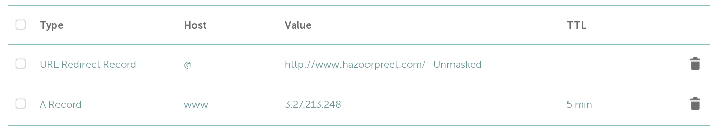
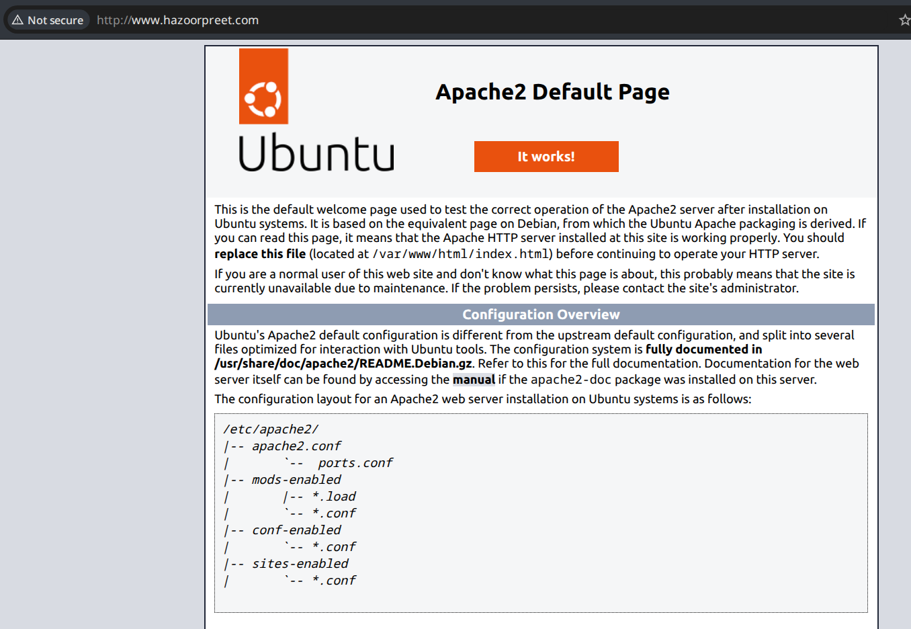
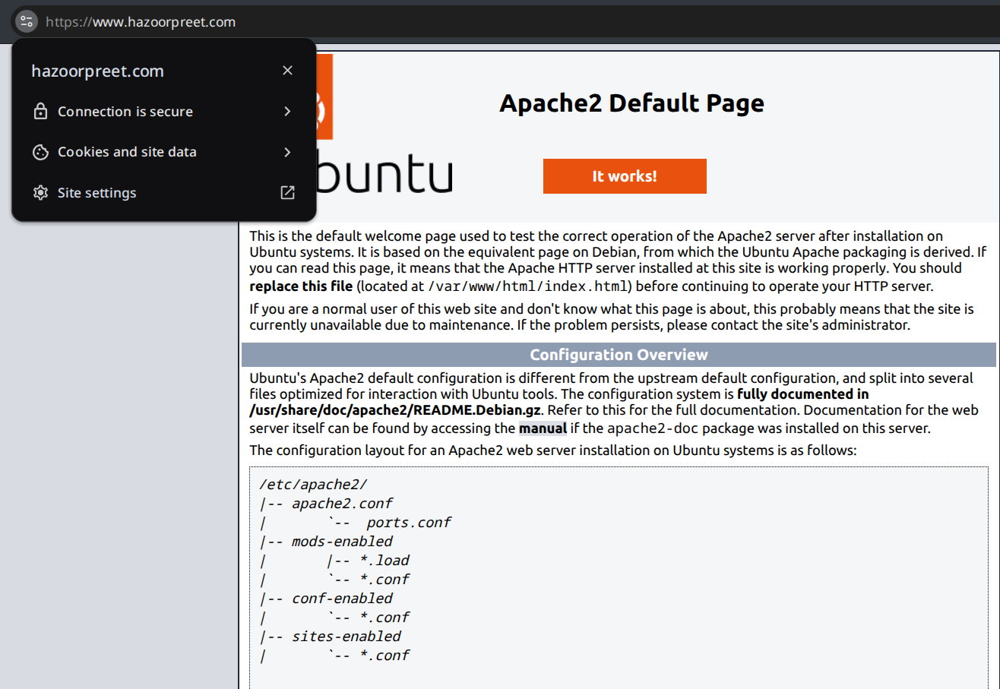
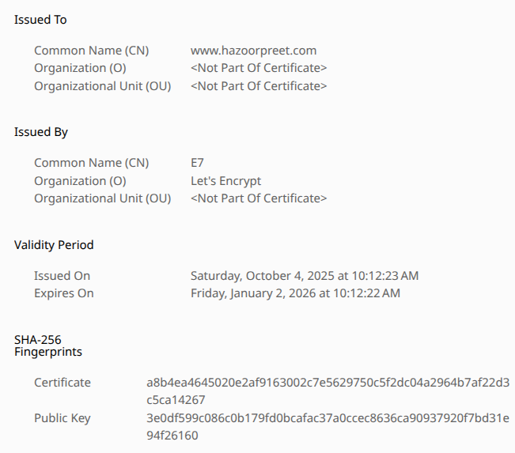

# DNS & Certificate

## Domain Setup

I started by creating an A record for the an AWS VM with Namecheap in the www subdomain:



I verified this by first gaining shell access
```
~
❯ chmod 600 Downloads/HTTPS\ Web\ Server.pem 
                                                                                                                                                                        
~   
❯ ssh -i Downloads/HTTPS\ Web\ Server.pem ubuntu@www.hazoorpreet.com
Welcome to Ubuntu 24.04.3 LTS (GNU/Linux 6.14.0-1011-aws x86_64)

 * Documentation:  https://help.ubuntu.com
 * Management:     https://landscape.canonical.com
 * Support:        https://ubuntu.com/pro

 System information as of Sat Oct  4 02:48:10 UTC 2025

  System load:  0.0               Temperature:           -273.1 C
  Usage of /:   25.6% of 6.71GB   Processes:             110
  Memory usage: 22%               Users logged in:       0
  Swap usage:   0%                IPv4 address for ens5: 172.31.3.194

Expanded Security Maintenance for Applications is not enabled.

0 updates can be applied immediately.

Enable ESM Apps to receive additional future security updates.
See https://ubuntu.com/esm or run: sudo pro status


The list of available updates is more than a week old.
To check for new updates run: sudo apt update


The programs included with the Ubuntu system are free software;
the exact distribution terms for each program are described in the
individual files in /usr/share/doc/*/copyright.

Ubuntu comes with ABSOLUTELY NO WARRANTY, to the extent permitted by
applicable law.

To run a command as administrator (user "root"), use "sudo <command>".
See "man sudo_root" for details.

ubuntu@ip-172-31-3-194:~$ 
```

I ran standard updates with `sudo apt update && sudo apt upgrade`. I installed apache2 and rebooted. After the reboot, I was able to successfully access the apache2 server from my browser at port 80



I ran `nslookup` and `dig` to check the details of my domain
```
~   
❯ nslookup www.hazoorpreet.com
Server:         9.9.9.9
Address:        9.9.9.9#53

Non-authoritative answer:
Name:   www.hazoorpreet.com
Address: 3.27.213.248

                                                                                                                                                                        
~   
❯ dig www.hazoorpreet.com

; <<>> DiG 9.20.13 <<>> www.hazoorpreet.com
;; global options: +cmd
;; Got answer:
;; ->>HEADER<<- opcode: QUERY, status: NOERROR, id: 7772
;; flags: qr rd ra ad; QUERY: 1, ANSWER: 1, AUTHORITY: 0, ADDITIONAL: 1

;; OPT PSEUDOSECTION:
; EDNS: version: 0, flags:; udp: 1232
; EDE: 3 (Stale Answer)
;; QUESTION SECTION:
;www.hazoorpreet.com.           IN      A

;; ANSWER SECTION:
www.hazoorpreet.com.    30      IN      A       3.27.213.248

;; Query time: 5 msec
;; SERVER: 9.9.9.9#53(9.9.9.9) (UDP)
;; WHEN: Sat Oct 04 11:01:37 +08 2025
;; MSG SIZE  rcvd: 70
```

For fun I also tried to scan it and check the whois data. I received expected results. I enabled domain privacy for this which was free on namecheap and set the security rules to allow http, https, and ssh traffic.

```
~   
❯ nmap www.hazoorpreet.com
Starting Nmap 7.98 ( https://nmap.org ) at 2025-10-04 11:03 +0800
Nmap scan report for www.hazoorpreet.com (3.27.213.248)
Host is up (0.098s latency).
rDNS record for 3.27.213.248: ec2-3-27-213-248.ap-southeast-2.compute.amazonaws.com
Not shown: 997 filtered tcp ports (no-response)
PORT    STATE  SERVICE
22/tcp  open   ssh
80/tcp  open   http
443/tcp closed https

Nmap done: 1 IP address (1 host up) scanned in 8.07 seconds

~   
❯ whois hazoorpreet.com
   Domain Name: HAZOORPREET.COM
   Registry Domain ID: 3025798545_DOMAIN_COM-VRSN
   Registrar WHOIS Server: whois.namecheap.com
   Registrar URL: http://www.namecheap.com
   Updated Date: 2025-10-04T02:36:26Z
   Creation Date: 2025-10-04T02:34:09Z
   Registry Expiry Date: 2026-10-04T02:34:09Z
   Registrar: NameCheap, Inc.
   Registrar IANA ID: 1068
   Registrar Abuse Contact Email: abuse@namecheap.com
   Registrar Abuse Contact Phone: +1.6613102107
   Domain Status: clientTransferProhibited https://icann.org/epp#clientTransferProhibited
   Name Server: DNS1.REGISTRAR-SERVERS.COM
   Name Server: DNS2.REGISTRAR-SERVERS.COM
   DNSSEC: signedDelegation
   DNSSEC DS Data: 9404 13 1 2988BE21999188A75186D1D08B192B7F9594578B
   URL of the ICANN Whois Inaccuracy Complaint Form: https://www.icann.org/wicf/
>>> Last update of whois database: 2025-10-04T03:02:30Z <<<

--snip--
The Registry database contains ONLY .COM, .NET, .EDU domains and
Registrars.
Domain name: hazoorpreet.com
Registry Domain ID: 3025798545_DOMAIN_COM-VRSN
Registrar WHOIS Server: whois.namecheap.com
Registrar URL: http://www.namecheap.com
Updated Date: 0001-01-01T00:00:00.00Z
Creation Date: 2025-10-04T02:34:09.00Z
--snip--

```

### Reflections

- Who issued the SSL certificate for murdoch.edu.au and csn.murdoch.edu.au?
    - While murdoch.edu.au is just a redirect, the certificate for www.murdoch.edu.au is issued by DigiCert Inc
    - https://csn.murdoch.edu.au is unable to load
- Can you use a subdomain to point to another student’s server?
    - Yes, just enter the IP of the server and set the host.

## TLS Certificate setup

I installed the snap package for certbot to my AWS VM.
```
ubuntu@ip-172-31-3-194:~$ sudo snap install --classic certbot
certbot 5.0.0 from Certbot Project (certbot-eff✓) installed
```

Setup of the Let's Encrypt Certificate was very quick and easy
```
ubuntu@ip-172-31-3-194:~$ sudo certbot --apache
Saving debug log to /var/log/letsencrypt/letsencrypt.log
Enter email address or hit Enter to skip.
 (Enter 'c' to cancel): 

- - - - - - - - - - - - - - - - - - - - - - - - - - - - - - - - - - - - - - - -
Please read the Terms of Service at:
https://letsencrypt.org/documents/LE-SA-v1.5-February-24-2025.pdf
You must agree in order to register with the ACME server. Do you agree?
- - - - - - - - - - - - - - - - - - - - - - - - - - - - - - - - - - - - - - - -
(Y)es/(N)o: y
Account registered.
Please enter the domain name(s) you would like on your certificate (comma and/or
space separated) (Enter 'c' to cancel): www.hazoorpreet.com
Requesting a certificate for www.hazoorpreet.com

Successfully received certificate.
Certificate is saved at: /etc/letsencrypt/live/www.hazoorpreet.com/fullchain.pem
Key is saved at:         /etc/letsencrypt/live/www.hazoorpreet.com/privkey.pem
This certificate expires on 2026-01-02.
These files will be updated when the certificate renews.
Certbot has set up a scheduled task to automatically renew this certificate in the background.

Deploying certificate
Successfully deployed certificate for www.hazoorpreet.com to /etc/apache2/sites-available/000-default-le-ssl.conf
Congratulations! You have successfully enabled HTTPS on https://www.hazoorpreet.com

- - - - - - - - - - - - - - - - - - - - - - - - - - - - - - - - - - - - - - - -
If you like Certbot, please consider supporting our work by:
 * Donating to ISRG / Let's Encrypt:   https://letsencrypt.org/donate
 * Donating to EFF:                    https://eff.org/donate-le
- - - - - - - - - - - - - - - - - - - - - - - - - - - - - - - - - - - - - - - -
```

I checked that it was set up by accessing the link with https://www.hazoorpreet.com and checking the certificate. I also tried to go to http://www.hazoorpreet.com again but it redirected to the secure site automatically.



I attempted simulating a renewal of the certificate. This went through without error
```
ubuntu@ip-172-31-3-194:~$ sudo certbot renew --dry-run
Saving debug log to /var/log/letsencrypt/letsencrypt.log

- - - - - - - - - - - - - - - - - - - - - - - - - - - - - - - - - - - - - - - -
Processing /etc/letsencrypt/renewal/www.hazoorpreet.com.conf
- - - - - - - - - - - - - - - - - - - - - - - - - - - - - - - - - - - - - - - -
Account registered.
Simulating renewal of an existing certificate for www.hazoorpreet.com

- - - - - - - - - - - - - - - - - - - - - - - - - - - - - - - - - - - - - - - -
Congratulations, all simulated renewals succeeded: 
  /etc/letsencrypt/live/www.hazoorpreet.com/fullchain.pem (success)
- - - - - - - - - - - - - - - - - - - - - - - - - - - - - - - - - - - - - - - -
```

I checked to make sure renewal was scheduled. I saw that snap.certbot.renew.timer was active.
```
ubuntu@ip-172-31-3-194:~$ systemctl list-timers
NEXT                             LEFT LAST                           PASSED UNIT                           ACTIVATES                       
Sat 2025-10-04 03:20:00 UTC   3min 8s Sat 2025-10-04 03:10:03 UTC  6min ago sysstat-collect.timer          sysstat-collect.service
Sat 2025-10-04 03:20:33 UTC  3min 42s Sat 2025-10-04 02:41:11 UTC         - fwupd-refresh.timer            fwupd-refresh.service
Sat 2025-10-04 06:14:00 UTC  2h 57min -                                   - snap.certbot.renew.timer       snap.certbot.renew.service
--snip--
```

It is good the certificate is set to auto-renew as if it was not, the browser would likely warn the user and block the site unless manually overcome.

### Reflections

- Why is HTTPS important for modern web applications?
    - HTTPS verifies that the contents of a site has not been tampered with from the intended source.
- What entity issued your site’s TLS certificate?
    - Let's Encrypt
- How long is your certificate valid for, and how can it be renewed?
    - The certificate is valid for approximately 3 months. It can be renewed automatically with certbot or manually with `sudo certbot renew`.
- What happens if a certificate expires and is not renewed?
    - If a certificate is not renewed it will automatically block the site on most browsers and warn the user that it is not secure. This can be overcome manually but reduces trust in a site.
- Why does Let’s Encrypt require port 80 or 443 to be open for verification?
    - To respond to challenges to verify that a link is really owned by the one setting up a web server.
