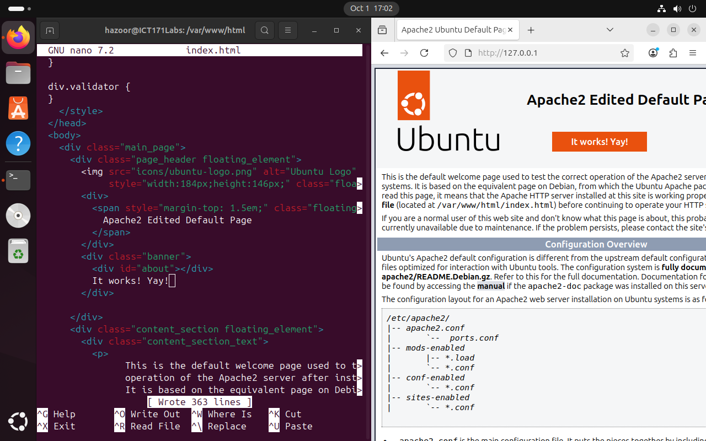

# Linux Services, SSH, Firewalls & Compression

I installed apache webserver using the `apt` package manager.
```
hazoor@ICT171Labs:~$ sudo apt install apache2
Reading package lists... Done
Building dependency tree... Done
Reading state information... Done
Suggested packages:
  apache2-doc apache2-suexec-pristine | apache2-suexec-custom
The following NEW packages will be installed:
  apache2
0 upgraded, 1 newly installed, 0 to remove and 0 not upgraded.
Need to get 90.2 kB of archives.
After this operation, 465 kB of additional disk space will be used.
Get:1 http://sg.archive.ubuntu.com/ubuntu noble-updates/main amd64 apache2 amd64 2.4.58-1ubuntu8.8 [90.2 kB]
Fetched 90.2 kB in 8s (11.7 kB/s)  
Selecting previously unselected package apache2.
(Reading database ... 166319 files and directories currently installed.)
Preparing to unpack .../apache2_2.4.58-1ubuntu8.8_amd64.deb ...
Unpacking apache2 (2.4.58-1ubuntu8.8) ...
Setting up apache2 (2.4.58-1ubuntu8.8) ...
apache-htcacheclean.service is a disabled or a static unit not running, not starting it.
Processing triggers for man-db (2.12.0-4build2) ...
Processing triggers for ufw (0.36.2-6) ...
```
I successfully accessed it through my own device


I was able to modify the content of the page with superuser permissions via `sudo nano`


I used the `ip a` command to find the NAT address of my device so that I could access the page from my host computer.
```
hazoor@ICT171Labs:/var/www/html$ ip a
1: lo: <LOOPBACK,UP,LOWER_UP> mtu 65536 qdisc noqueue state UNKNOWN group default qlen 1000
    link/loopback 00:00:00:00:00:00 brd 00:00:00:00:00:00
    inet 127.0.0.1/8 scope host lo
       valid_lft forever preferred_lft forever
    inet6 ::1/128 scope host noprefixroute 
       valid_lft forever preferred_lft forever
2: enp1s0: <BROADCAST,MULTICAST,UP,LOWER_UP> mtu 1500 qdisc fq_codel state UP group default qlen 1000
    link/ether 52:54:00:d2:9c:93 brd ff:ff:ff:ff:ff:ff
    inet 192.168.122.195/24 brd 192.168.122.255 scope global dynamic noprefixroute enp1s0
       valid_lft 2401sec preferred_lft 2401sec
    inet6 fe80::5054:ff:fed2:9c93/64 scope link 
       valid_lft forever preferred_lft forever
```


To see which ports were open, I used an nmap scan from my host to check the ports of the guest, getting the following output
```
~
❯ nmap scan 192.168.122.195
Starting Nmap 7.97 ( https://nmap.org ) at 2025-10-01 17:13 +0800
Failed to resolve "scan".
Nmap scan report for 192.168.122.195
Host is up (0.00012s latency).
Not shown: 999 closed tcp ports (conn-refused)
PORT   STATE SERVICE
80/tcp open  http

Nmap done: 1 IP address (1 host up) scanned in 1.13 seconds
```
I proceeded to remove apache2 and got the following result:
```
~
❯ nmap scan 192.168.122.195
Starting Nmap 7.97 ( https://nmap.org ) at 2025-10-01 17:16 +0800
Nmap scan report for 192.168.122.195
Host is up (0.00013s latency).
All 1000 scanned ports on 192.168.122.195 are in ignored states.
Not shown: 1000 closed tcp ports (conn-refused)

Nmap done: 1 IP address (1 host up) scanned in 1.14 seconds
```
The apache2 service was listening on port 80.

I checked on the firewall, and found it was inactive
```
hazoor@ICT171Labs:~$ sudo ufw status verbose
Status: inactive
```
I proceeded to enable it and checked again
```
hazoor@ICT171Labs:~$ sudo ufw enable
Firewall is active and enabled on system startup
hazoor@ICT171Labs:~$ sudo ufw status verbose
Status: active
Logging: on (low)
Default: deny (incoming), allow (outgoing), disabled (routed)
New profiles: skip
```
I allowed port 80 tcp traffic for the webserver
```
hazoor@ICT171Labs:~$ sudo ufw allow 80/tcp
Rule added
Rule added (v6)
hazoor@ICT171Labs:~$ sudo ufw status verbose
Status: active
Logging: on (low)
Default: deny (incoming), allow (outgoing), disabled (routed)
New profiles: skip

To                         Action      From
--                         ------      ----
80/tcp                     ALLOW IN    Anywhere                  
80/tcp (v6)                ALLOW IN    Anywhere (v6) 
```
I scanned the device with nmap from the host
```
~
❯ nmap 192.168.122.195
Starting Nmap 7.97 ( https://nmap.org ) at 2025-10-01 17:21 +0800
Nmap scan report for 192.168.122.195
Host is up (0.00021s latency).
Not shown: 998 filtered tcp ports (no-response)
PORT   STATE  SERVICE
53/tcp closed domain
80/tcp closed http

Nmap done: 1 IP address (1 host up) scanned in 5.02 seconds
```

I installed openssh-server and allowed port 22 on ufw to attempt an ssh connection, resulting in the following:
``` 
~
❯ ssh hazoor@192.168.122.195
hazoor@192.168.122.195's password:
Welcome to Ubuntu 24.04.3 LTS (GNU/Linux 6.14.0-32-generic x86_64)

* Documentation:  https://help.ubuntu.com
* Management:     https://landscape.canonical.com
* Support:        https://ubuntu.com/pro

Expanded Security Maintenance for Applications is not enabled.

15 updates can be applied immediately.
2 of these updates are standard security updates.
To see these additional updates run: apt list --upgradable

28 additional security updates can be applied with ESM Apps.
Learn more about enabling ESM Apps service at https://ubuntu.com/esm

Last login: Tue Sep 30 09:56:17 2025 from 192.168.122.1
hazoor@ICT171Labs:~$ 
```

I added a new user with the `adduser` command from root
```
hazoor@ICT171Labs:~$ sudo adduser new
info: Adding user `new' ...
info: Selecting UID/GID from range 1000 to 59999 ...
info: Adding new group `new' (1001) ...
info: Adding new user `new' (1001) with group `new (1001)' ...
info: Creating home directory `/home/new' ...
info: Copying files from `/etc/skel' ...
New password: 
BAD PASSWORD: The password is shorter than 8 characters
Retype new password: 
passwd: password updated successfully
Changing the user information for new
Enter the new value, or press ENTER for the default
	Full Name []: 
	Room Number []: 
	Work Phone []: 
	Home Phone []: 
	Other []: 
Is the information correct? [Y/n] 
info: Adding new user `new' to supplemental / extra groups `users' ...
info: Adding user `new' to group `users' ...
```
I saw the following addition near the end of my /etc/passwd file
```
hazoor@ICT171Labs:~$ cat /etc/passwd
--snip--
hazoor:x:1000:1000:Hazoorpreet:/home/hazoor:/bin/bash
sshd:x:122:65534::/run/sshd:/usr/sbin/nologin
new:x:1001:1001:,,,:/home/new:/bin/bash
```

I downloaded some files from Project Gutenberg with `wget` then compressed them into an archive, which was then compressed.
```
hazoor@ICT171Labs:~/Downloads$ ls -l ./books
total 1112
-rw-rw-r-- 1 hazoor hazoor 172775 Jul  3 01:09 12-0.txt
-rw-rw-r-- 1 hazoor hazoor 366448 Nov 27  2021 36-0.txt
-rw-rw-r-- 1 hazoor hazoor 590756 Jun 15 01:09 76-0.txt
hazoor@ICT171Labs:~/Downloads$ tar cf books.tar books
hazoor@ICT171Labs:~/Downloads$ ls -l
total 1116
drwxrwxr-x 2 hazoor hazoor    4096 Oct  1 17:35 books
-rw-rw-r-- 1 hazoor hazoor 1136640 Oct  1 17:37 books.tar
hazoor@ICT171Labs:~/Downloads$ bzip2 books.tar
hazoor@ICT171Labs:~/Downloads$ ls -la
total 328
drwxr-xr-x  3 hazoor hazoor   4096 Oct  1 17:38 .
drwxr-x--- 19 hazoor hazoor   4096 Sep 30 13:33 ..
drwxrwxr-x  2 hazoor hazoor   4096 Oct  1 17:35 books
-rw-rw-r--  1 hazoor hazoor 323154 Oct  1 17:37 books.tar.bz2
```

I moved this file to my documents folder and decompressed and unarchived it.
```
hazoor@ICT171Labs:~/Downloads$ mv books
books/         books.tar.bz2  
hazoor@ICT171Labs:~/Downloads$ mv books.tar.bz2 ~/Documents
hazoor@ICT171Labs:~/Downloads$ cd ~/Documents
hazoor@ICT171Labs:~/Documents$ ls -la
total 340
drwxr-xr-x  2 hazoor hazoor   4096 Oct  1 17:39 .
drwxr-x--- 19 hazoor hazoor   4096 Sep 30 13:33 ..
-rw-rw-r--  1 hazoor hazoor 323154 Oct  1 17:37 books.tar.bz2
-rw-rw-r--  1 hazoor hazoor   9876 Sep 30 11:17 Hello.odt
-rw-rw-r--  1 hazoor hazoor     27 Sep 30 11:48 testfile2.txt
hazoor@ICT171Labs:~/Documents$ bunzip2 books.tar.bz2 
hazoor@ICT171Labs:~/Documents$ tar xvf books.tar 
books/
books/12-0.txt
books/76-0.txt
books/36-0.txt
hazoor@ICT171Labs:~/Documents$ ls -la
total 1140
drwxr-xr-x  3 hazoor hazoor    4096 Oct  1 17:40 .
drwxr-x--- 19 hazoor hazoor    4096 Sep 30 13:33 ..
drwxrwxr-x  2 hazoor hazoor    4096 Oct  1 17:35 books
-rw-rw-r--  1 hazoor hazoor 1136640 Oct  1 17:37 books.tar
-rw-rw-r--  1 hazoor hazoor    9876 Sep 30 11:17 Hello.odt
-rw-rw-r--  1 hazoor hazoor      27 Sep 30 11:48 testfile2.txt
hazoor@ICT171Labs:~/Documents$ ls -la ./books
total 1120
drwxrwxr-x 2 hazoor hazoor   4096 Oct  1 17:35 .
drwxr-xr-x 3 hazoor hazoor   4096 Oct  1 17:40 ..
-rw-rw-r-- 1 hazoor hazoor 172775 Jul  3 01:09 12-0.txt
-rw-rw-r-- 1 hazoor hazoor 366448 Nov 27  2021 36-0.txt
-rw-rw-r-- 1 hazoor hazoor 590756 Jun 15 01:09 76-0.txt
```

I successfully copied a directory to my guest's downloads folder from my host using `scp`
```
/tmp
❯ scp -r SCPTest hazoor@192.168.122.195:~/Downloads
hazoor@192.168.122.195's password:
file3.txt                                                    100%    6    23.0KB/s   00:00
file2.txt                                                    100%    3    25.4KB/s   00:00
file1.txt                                                    100%    6    71.1KB/s   00:00

```

Most of the exercises afterward in this rest of this lab are repeats of ones already done in [Ubuntu Familiarization](./UbuntuFamiliarization.md)

I used ssh to create a file on the desktop
```
/tmp
❯ ssh hazoor@192.168.122.195
hazoor@192.168.122.195's password: 
Welcome to Ubuntu 24.04.3 LTS (GNU/Linux 6.14.0-32-generic x86_64)

 * Documentation:  https://help.ubuntu.com
 * Management:     https://landscape.canonical.com
 * Support:        https://ubuntu.com/pro

Expanded Security Maintenance for Applications is not enabled.

15 updates can be applied immediately.
2 of these updates are standard security updates.
To see these additional updates run: apt list --upgradable

28 additional security updates can be applied with ESM Apps.
Learn more about enabling ESM Apps service at https://ubuntu.com/esm

Last login: Wed Oct  1 17:59:21 2025 from 192.168.122.1
hazoor@ICT171Labs:~$ cd Desktop/
hazoor@ICT171Labs:~/Desktop$ touch Hi_Hazoor
```


I tried to gedit from my host device to my guest, but it did not work. Instead it opened in the guest. This may be due to the fact that the Host uses Wayland as a windowing system rather than X11.


## Reflection

- What’s the role of a firewall in managing services?
    - Linux firewalls protect a system from being accessed by attackers. Ports must be opened for services to be exposed externally.
- How did SSH access deepen your understanding of Linux as a server?
    - SSH access showed how linux servers are commonly administered using the Command Line Interface (CLI). Many servers run in "headless" configurations, lacking a Graphical User Interface (GUI) entirely.
- Why is file compression important in server contexts?
    - File compression is needed when transferring files or conserving space on a system. File transfers are faster at smaller sizes and old logs can be archived to keep them from taking too much space.
- How does user privilege management help secure systems?
    - Users should be restricted to the privileges needed for their usage scope. Anything more can allow a user or malicious attacker who may gain access to the user's account to do more damage to a system.
