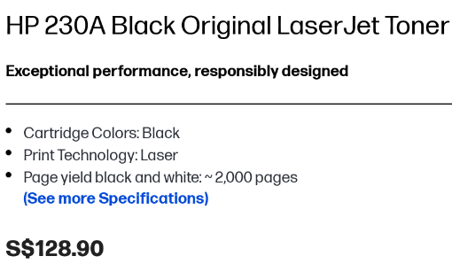

# Printer TCO Analysis

In this scenario, there are 5 offices that need new printers. The company prefers HP and wants their best, but are facing a decision between InkJet and LaserJet.

For the printer TCO analysis, two printers have been chosen:

- [HP OfficeJet Pro 9730 Wide Format All-in-One Printer (537P5B)](https://www.hp.com/sg-en/shop/hp-officejet-pro-9730-wide-format-all-in-one-printer-537p5b.html), an InkJet Office Printer (Referred to in this document as "InkJet Printer")
- [HP Color LaserJet Pro MFP 4303dw Printer (5HH65A)](https://www.hp.com/sg-en/shop/hp-color-laserjet-pro-mfp-4303dw-printer-5hh65a.html), a LaserJet Office Printer (Referred to in this document as "LaserJet Printer")

    The following assumptions have been made:

- Period of 3 years (due to warranty offered by HP)
- Pages printed per week: 750
    - 117,000 per year (multipled by 52)
- Weekly runtime: 40 hours

From research the following was found:

- Electricity price for businesses: S$0.237 from https://www.globalpetrolprices.com/Singapore/electricity_prices/

- Price of paper (per 500 in ream): S$9.25 from https://www.amazon.sg/Paperone-Copier-A4-80-GSM/dp/B01LZ3LYBY

The fixed costs are as follows:

InkJet Printer
| Type     | Price    |
|----------|----------|
| Upfront  | S$689.00 |
| Warranty | S$196.00 |

LaserJet Printer
| Type     | Price     |
|----------|-----------|
| Upfront  | S$1499.00 |
| Warranty | S$0.00    |

Each printers' variable prices are as follows:

Ink (For both printers, all colors except black are the same price)
| Printer  | Ink     | Ink Price (1 cartridge each color) | Pages per black cartridge | Total Price for Period |
|----------|---------|------------------------------------|---------------------------|------------------------|
| InkJet   | HP 937  | S$184.00                           | 1,250                     | S$17,222.40            |
| LaserJet | HP 230A | S$600.50                           | 2,000                     | S$35,129.25            |

Wattage
| Printer  | Power usage (W/h) | Power Usage per year (kWh) | Total Price for Period |
|----------|-------------------|----------------------------|------------------------|
| InkJet   | 5.40              | 11.23                      | S$7.99                 |
| LaserJet | 18.00             | 37.44                      | S$26.62                |

Paper cost is the same for both printers, S$2,164.50 for period

The following is the general TCO breakdown for each printer for the period:

InkJet:
- Fixed Costs: S$885
    - Upfront: S$689.00
    - Warranty: S$196.00
- Variable Costs: 17396.89
    - Power: S$7.99
    - Ink: S$17,222.40
    - Paper: S$2,164.50
- Grand Total TCO: S$20,279.89
- Cost Per Page: S$0.17

LaserJet:
- Fixed Costs: S$1,499
    - Upfront: S$1,499.00
    - Warranty: S$0.00
- Variable Costs: S$37320.37
    - Power: S$26.62
    - Ink: S$35,129.25
    - Paper: S$2,164.50
- Grand Total TCO: S$38,819.37
- Cost Per Page: S$0.33

## Reflections

- Which printer has lower TCO and why?
    - InkJet has the lower TCO due to lower initial cost and lower price per page. It also has notably less features than a LaserJet, but for most basic office work, can get the job done.
- Would the choice change if only 5 pages/week were printed?
    - No, ink and inital costs are a vastly different.
- What other qualitative or intangible factors could be considered (e.g., print speed, brand support, reliability)?
    - Print speed could be useful if this was a shared printer between many people
    - Brand support is the largely the same between the two
    - Feature set could be a consideration if more advanced features are required
- For a large workgroup printer, what cost/performance specs would you now prioritize?
    - Print speed & reliability due to large volume of prints required.
- Estimate the breakeven time point where both printers cost the same.
    - None, LaserJet printers are vastly more expensive due to their feature sets, both in initial price and in operating expenses.