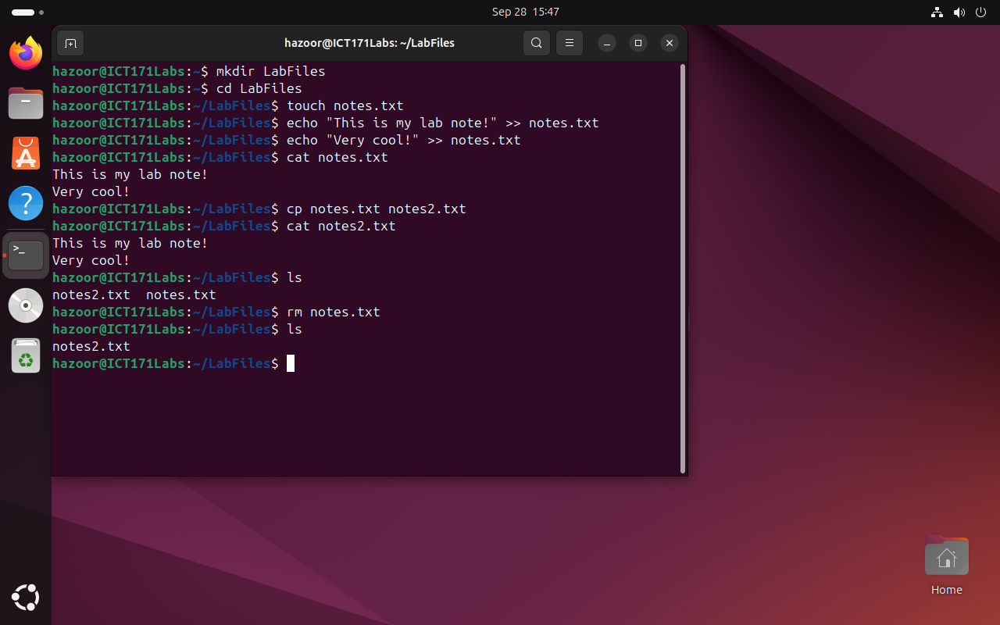
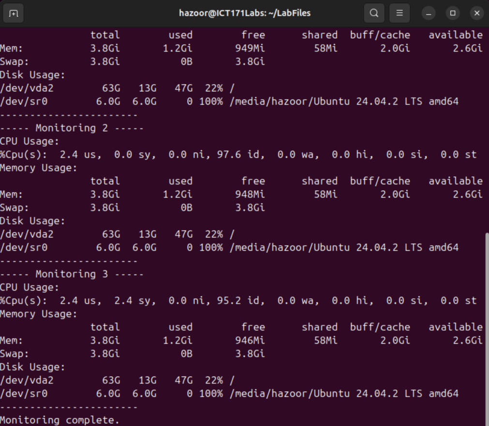

# Scripting & Automation

## Introduction to Bash

Interacting with the command line with basic commands is simple to understand. Especially with each command for one simple purpose.



- What command did you use to create a directory?
    - `mkdir`
- How can you view file content without a GUI editor?
    - `gedit <filename>`
- What is the difference between cp and mv?
    - `cp` will copy a file from one location to another.
    - `mv` will copy a file from one location to another and remove the original.

I created a hello world script using `nano` and ran it successfully.


- What is chmod +x for?
    - Allow execution of a file
- Why is #!/bin/bash used?
    - Shebang (#!) denotes a program to be used to run a script. `/bin/bash` is the location of the executable that will run the following script.
- How can you personalize script output?
    - Adding additional arguments in the script itself, which can be referenced with `$<number>` or referencing environmental variables with `$<VARNAME>`

System Information script was created and run easily as well


- How does the for loop work?
    - Sets a pivoting variable that changes across a certain range for each iteration of the loop
- What happens if number > 10?
    - The `else` clause catches it, outputting “Number out of range.”
- How could invalid input be handled more gracefully?
    - It could loop back to ask for a number until it receives a valid number using a `while` loop

System resource monitoring script also ran without problems.



### Reflections

- What does free -h show?
    - Free memory on mounted storage
- How can this script be modified to monitor network usage?
    - Using the `sar -n DEV --iface="<NetworkDeviceName>"` command to retrieve system network usage on each device
- Why is automation important for admins? 
    - Keeps systems running smoothly without extra work, automating and simplifying repetitive tasks.

## Linux Server Management Scripts

For linux scripting, I started with a simple `CreateUser.sh`:
```bash
#!/usr/bin/env bash

read -p "Enter User ID: " user
useradd -m "$user"
passwd "$user"
```

I first tried running the script, but remembered only root could make new user, so re-ran it with root privilege. It ran successfully with `sudo`.
```
hazoor@ICT171Labs:~/LabFiles$ nano CreateUser.sh
hazoor@ICT171Labs:~/LabFiles$ chmod +x CreateUser.sh 
hazoor@ICT171Labs:~/LabFiles$ ./CreateUser.sh
Enter User ID: newuser
useradd: Permission denied.
useradd: cannot lock /etc/passwd; try again later.
passwd: user 'newuser' does not exist
hazoor@ICT171Labs:~/LabFiles$ sudo ./CreateUser.sh 
Enter User ID: newuser
New password: 
BAD PASSWORD: The password is shorter than 8 characters
Retype new password: 
passwd: password updated successfully
hazoor@ICT171Labs:~/LabFiles$ id newuser
uid=1001(newuser) gid=1001(newuser) groups=1001(newuser)
```

I then proceeded to create `AddUserGroup.sh` to add the user to a created group
```bash
#!/usr/bin/env bash

read -p "Group name: " group
read -p "User to add: " user
groupadd "$group"
usermod -aG "$group" "$user"
```

I remembered to run this one with `sudo` so faced no errors.
```
hazoor@ICT171Labs:~/LabFiles$ nano AddUserGroup.sh
hazoor@ICT171Labs:~/LabFiles$ chmod +x AddUserGroup.sh 
hazoor@ICT171Labs:~/LabFiles$ sudo ./AddUserGroup.sh
Group name: newgrp
User to add: newuser
hazoor@ICT171Labs:~/LabFiles$ groups newuser
newuser : newuser newgrp
```

To create multiple users from a csv, a while loop had to be used in `CreateUsersCSV.sh`:
```bash
#!/usr/bin/env bash

while IFS=',' read -r username password; do
    useradd -m "$username"
    echo "$username:$password" | chpasswd
done < $1
```

For this, I created the following CSV:
```
user1,pass1
user2,pass2
user3,pass3
user4,pass4
```

I ran the script with sudo, getting the following output. I made sure to verify the user creations by getting the last 4 entries of `/etc/passwd`:
```
hazoor@ICT171Labs:~/LabFiles$ nano ./CreateUsersCSV.sh 
hazoor@ICT171Labs:~/LabFiles$ chmod +x ./CreateUsersCSV.sh 
hazoor@ICT171Labs:~/LabFiles$ nano users_to_create.csv
hazoor@ICT171Labs:~/LabFiles$ sudo ./CreateUsersCSV.sh users_to_create.csv
BAD PASSWORD: The password is shorter than 8 characters
BAD PASSWORD: The password is shorter than 8 characters
BAD PASSWORD: The password is shorter than 8 characters
BAD PASSWORD: The password is shorter than 8 characters
hazoor@ICT171Labs:~/LabFiles$ tail -4 /etc/passwd
user1:x:1002:1003::/home/user1:/bin/sh
user2:x:1003:1004::/home/user2:/bin/sh
user3:x:1004:1005::/home/user3:/bin/sh
user4:x:1005:1006::/home/user4:/bin/sh
```

To try setting quotas for home directories, I needed to understand how quotas worked. For this, I tried to acccess the manual page. When this didn't work, I tried to run it with the `--help` switch, to find that the command was not even installed.
```
hazoor@ICT171Labs:~/LabFiles$ man setquota
No manual entry for setquota
hazoor@ICT171Labs:~/LabFiles$ setquota --help
Command 'setquota' not found, but can be installed with:
sudo apt install quota
```

It seemed I had to install the `quota` package, so I did as advised by the error. After which, I was able to access the manual entry just fine and get the information required to create the following script `SetHomeQuota.sh`:
```bash
#!/usr/bin/env bash

read -p "Enter User (KB): " user
read -p "Enter Home Quota: " home_quota
setquota -u $user $home_quota $home_quota 0 0 /home
```
Unfortunately I could not test this script as `/home` was not a mountpoint for a separate drive or partition from `/`, however it is correctly formatted for the command usage.

The following script, `DriveUsage.sh` was used to warn when drive usage is over 25%:
```bash
#!/usr/bin/env bash

df -h | grep '^/dev/' | awk '{print $5, $6}' | while read use mount; do
    if [ "${use%%%}" -gt 25 ]; then
        echo "Disk usage alert: $mount at $use"
    fi
done
```

This ran successfully, though notably it also detected the virtual disk drive. After ejecting it from GUI, it was no longer detected.
```
hazoor@ICT171Labs:~/LabFiles$ nano DriveUsage.sh
hazoor@ICT171Labs:~/LabFiles$ chmod +x DriveUsage.sh 
hazoor@ICT171Labs:~/LabFiles$ ./DriveUsage.sh 
Disk usage alert: / at 28%
Disk usage alert: /media/hazoor/Ubuntu at 100%
hazoor@ICT171Labs:~/LabFiles$ ./DriveUsage.sh 
Disk usage alert: / at 28%
```

I used the following script to check if any specific home folder was using >90% of storage
```bash
#!/usr/bin/env bash

for dir in /home/*; do
    [ -d "$dir" ] || continue
    size=$(du -s "$dir" | awk '{print $1}')
    usage=$(($size * 100 / $(df --output=size $dir | awk '{print $1}' | \grep -P '^\d[^a-zA-Z]')))
    if [ $usage -gt 90 ]; then
        echo "$dir is using $usage% of storage"
    fi
done
```
This gave me no output as my largest home folder used less than 1GB of the 64GB I allocated.

I used a one-liner with `ps` and `head` to check the top memory utilizing applications.
```
hazoor@ICT171Labs:~/LabFiles$ ps aux --sort=-%mem | head -n 11
USER         PID %CPU %MEM    VSZ   RSS TTY      STAT START   TIME COMMAND
hazoor      2283  1.4  9.5 5014676 381976 ?      Ssl  08:58   1:18 /usr/bin/gnome-shell
hazoor      2831  0.0  2.5 1413008 101684 ?      Sl   08:58   0:00 /usr/libexec/mutter-x11-frames
hazoor      2719  0.0  2.0 640960 83408 ?        Ssl  08:58   0:00 /usr/libexec/gsd-xsettings
hazoor      2526  0.0  1.7 256104 71112 ?        S    08:58   0:00 /usr/bin/Xwayland :0 -rootless -noreset -accessx -core -auth /run/user/1000/.mutter-Xwaylandauth.M4J2D3 -listenfd 4 -listenfd 5 -displayfd 6 -initfd 7 -byteswappedclients
hazoor      2759  0.0  1.5 2941528 61804 ?       Sl   08:58   0:00 gjs /usr/share/gnome-shell/extensions/ding@rastersoft.com/app/ding.js -E -P /usr/share/gnome-shell/extensions/ding@rastersoft.com/app
hazoor      2851  0.0  1.5 823828 60224 ?        Sl   08:58   0:00 /usr/libexec/evolution-data-server/evolution-alarm-notify
hazoor     10584  0.2  1.4 700364 57040 ?        Ssl  09:36   0:06 /usr/libexec/gnome-terminal-server
hazoor      2395  0.0  1.0 1272696 42920 ?       Ssl  08:58   0:00 /usr/libexec/evolution-source-registry
root        5159  0.0  1.0 480008 41308 ?        Ssl  09:00   0:00 /usr/libexec/fwupd/fwupd
hazoor      2820  0.0  1.0 556400 40276 ?        Ssl  08:58   0:00 /usr/libexec/xdg-desktop-portal-gnome
```

I tried another one-liner with `ps` and `awk` that allowed me to see high-cpu using processes (>80%) but could only test it with >20% as I had no intensive applications running
```
hazoor@ICT171Labs:~/LabFiles$ ps -eo pid,ppid,cmd,%cpu --sort=-%cpu | awk '$NF>80'
hazoor@ICT171Labs:~/LabFiles$ ps -eo pid,ppid,cmd,%cpu --sort=-%cpu | awk '$NF>20'
  11574    2283 /snap/firefox/6966/usr/lib/ 22.6
```

I used `ss` to check open ports
```
hazoor@ICT171Labs:~/LabFiles$ ss -tuln
Netid  State   Recv-Q  Send-Q   Local Address:Port    Peer Address:Port Process 
udp    UNCONN  0       0              0.0.0.0:5353         0.0.0.0:*            
udp    UNCONN  0       0           127.0.0.54:53           0.0.0.0:*            
udp    UNCONN  0       0        127.0.0.53%lo:53           0.0.0.0:*            
udp    UNCONN  0       0              0.0.0.0:37106        0.0.0.0:*            
udp    UNCONN  0       0                 [::]:5353            [::]:*            
udp    UNCONN  0       0                 [::]:35216           [::]:*            
tcp    LISTEN  0       4096        127.0.0.54:53           0.0.0.0:*            
tcp    LISTEN  0       4096           0.0.0.0:22           0.0.0.0:*            
tcp    LISTEN  0       4096     127.0.0.53%lo:53           0.0.0.0:*            
tcp    LISTEN  0       4096         127.0.0.1:631          0.0.0.0:*            
tcp    LISTEN  0       4096              [::]:22              [::]:*            
tcp    LISTEN  0       511                  *:80                 *:*            
tcp    LISTEN  0       4096             [::1]:631             [::]:*            
```

The `sar` command allowed me to check the bandwidth speed of my connections by their interface.
```
hazoor@ICT171Labs:~/LabFiles$ sar -n DEV --iface="enp1s0"
Linux 6.14.0-32-generic (ICT171Labs) 	10/06/2025 	_x86_64_	(4 CPU)

08:58:42 AM  LINUX RESTART	(4 CPU)

09:00:10 AM     IFACE   rxpck/s   txpck/s    rxkB/s    txkB/s   rxcmp/s   txcmp/s  rxmcst/s   %ifutil
09:10:05 AM    enp1s0      0.80      0.21      0.18      0.05      0.00      0.00      0.00      0.00
09:20:00 AM    enp1s0      0.84      0.17      0.41      0.01      0.00      0.00      0.00      0.00
09:30:13 AM    enp1s0      9.50      3.88     22.66      0.25      0.00      0.00      0.00      0.00
09:40:14 AM    enp1s0      0.64      0.04      0.04      0.00      0.00      0.00      0.00      0.00
09:50:02 AM    enp1s0      0.64      0.03      0.04      0.00      0.00      0.00      0.00      0.00
10:00:14 AM    enp1s0      0.69      0.08      0.08      0.01      0.00      0.00      0.00      0.00
10:10:13 AM    enp1s0      0.65      0.04      0.04      0.00      0.00      0.00      0.00      0.00
10:20:07 AM    enp1s0      0.64      0.04      0.04      0.00      0.00      0.00      0.00      0.00
10:30:01 AM    enp1s0      0.65      0.04      0.05      0.00      0.00      0.00      0.00      0.00
10:40:03 AM    enp1s0      0.68      0.07      0.08      0.01      0.00      0.00      0.00      0.00
Average:       enp1s0      1.59      0.47      2.41      0.03      0.00      0.00      0.00      0.00
```

I set a cronjob to make sure that apache never shut down, checking every minute
```
* * * * * if ! systemctl is-active --quiet apache2; then systemctl restart apache2; fi
```
This would run at every minute, so after shutting it down, I monitored. Sure enough, it restarted automatically.
```
hazoor@ICT171Labs:~/LabFiles$ sudo systemctl status apache2.service 
\u25cb apache2.service - The Apache HTTP Server
     Loaded: loaded (/usr/lib/systemd/system/apache2.service; enabled; preset: enabled)
     Active: inactive (dead) since Mon 2025-10-06 10:52:36 +08; 2min 12s ago
   Duration: 1h 53min 53.186s
       Docs: https://httpd.apache.org/docs/2.4/
    Process: 13119 ExecStop=/usr/sbin/apachectl graceful-stop (code=exited, status=0/SUCCESS)
   Main PID: 1330 (code=exited, status=0/SUCCESS)
        CPU: 471ms

Oct 06 08:58:43 ICT171Labs systemd[1]: Starting apache2.service - The Apache HTTP Server...
Oct 06 08:58:43 ICT171Labs apachectl[1321]: AH00557: apache2: apr_sockaddr_info_get() failed for ICT171La>
Oct 06 08:58:43 ICT171Labs apachectl[1321]: AH00558: apache2: Could not reliably determine the server's f>
Oct 06 08:58:43 ICT171Labs systemd[1]: Started apache2.service - The Apache HTTP Server.
Oct 06 10:52:36 ICT171Labs systemd[1]: Stopping apache2.service - The Apache HTTP Server...
Oct 06 10:52:36 ICT171Labs apachectl[13123]: AH00558: apache2: Could not reliably determine the server's >
Oct 06 10:52:36 ICT171Labs systemd[1]: apache2.service: Deactivated successfully.
Oct 06 10:52:36 ICT171Labs systemd[1]: Stopped apache2.service - The Apache HTTP Server.

hazoor@ICT171Labs:~/LabFiles$ sudo systemctl status apache2.service 
\u25cf apache2.service - The Apache HTTP Server
     Loaded: loaded (/usr/lib/systemd/system/apache2.service; enabled; preset: enabled)
     Active: active (running) since Mon 2025-10-06 10:55:02 +08; 25s ago
       Docs: https://httpd.apache.org/docs/2.4/
    Process: 14251 ExecStart=/usr/sbin/apachectl start (code=exited, status=0/SUCCESS)
   Main PID: 14254 (apache2)
      Tasks: 55 (limit: 4603)
     Memory: 5.5M (peak: 6.2M)
        CPU: 20ms
     CGroup: /system.slice/apache2.service
             \u251c\u250014254 /usr/sbin/apache2 -k start
             \u251c\u250014255 /usr/sbin/apache2 -k start
             \u2514\u250014257 /usr/sbin/apache2 -k start

Oct 06 10:55:02 ICT171Labs systemd[1]: Starting apache2.service - The Apache HTTP Server...
Oct 06 10:55:02 ICT171Labs apachectl[14253]: AH00558: apache2: Could not reliably determine the server's >
Oct 06 10:55:02 ICT171Labs systemd[1]: Started apache2.service - The Apache HTTP Server.
```

I tested a command to backup service configurations directory into a gzip tar archive.
```
hazoor@ICT171Labs:~/LabFiles$ sudo tar -czf /backup/etc_$(date +%F).tar.gz /etc
tar: Removing leading `/' from member names
hazoor@ICT171Labs:~/LabFiles$ ls /backup
etc_2025-10-06.tar.gz
```

I also checked failed SSH attempts. This one-line script used `grep` to fetch the full log entry of failed passwords, `awk` to retrieve the IP address, `sort` to sort by the address, `uniq -c` to count the frequency for each unique address, `sort -nr` to sort by the frequency of IP address (with the highest amount of failed passwords first), finally into `head` to print the top 10.
```bash
grep "Failed password" /var/log/auth.log | awk '{print $(NF-3)}' | sort | uniq -c | sort -nr | head
```
I had only one IP entry due to using my host to access the guest
```
hazoor@ICT171Labs:~/LabFiles$ grep "Failed password" /var/log/auth.log | awk '{print $(NF-3)}' | sort | uniq -c | sort -nr | head
      2 192.168.122.1
```

To see if the device could ping some servers, I could use the following single-line script
```
hazoor@ICT171Labs:~/LabFiles$ for s in 8.8.8.8 example.com; do ping -c 1 $s && echo "$s OK" || echo "$s FAIL"; done
PING 8.8.8.8 (8.8.8.8) 56(84) bytes of data.
64 bytes from 8.8.8.8: icmp_seq=1 ttl=112 time=46.8 ms

--- 8.8.8.8 ping statistics ---
1 packets transmitted, 1 received, 0% packet loss, time 0ms
rtt min/avg/max/mdev = 46.811/46.811/46.811/0.000 ms
8.8.8.8 OK
PING example.com (23.220.75.245) 56(84) bytes of data.
64 bytes from a23-220-75-245.deploy.static.akamaitechnologies.com (23.220.75.245): icmp_seq=1 ttl=45 time=305 ms

--- example.com ping statistics ---
1 packets transmitted, 1 received, 0% packet loss, time 0ms
rtt min/avg/max/mdev = 304.568/304.568/304.568/0.000 ms
example.com OK
```

I cleaned up some of the old logs with assistance from the `find` command.
```
hazoor@ICT171Labs:~/LabFiles$ sudo find /var/log -name "*.log" -mtime +14 -delete
```

I ended by scheduling a reboot using the `at` command
```
echo "/usr/bin/reboot" | at now + 10 minutes
```

## Apache Log Parsing

I used the following script to parse apache2 logs into a CSV:
```bash
#!/usr/bin/env bash

LOGFILE="/var/log/apache2/access.log"
REGEX='^([0-9]+\.[0-9]+\.[0-9]+\.[0-9]+) .* \[([^\]]+)\] "([A-Z]+) ([^ ]+) HTTP/[0-9.]+" ([0-9]{3}) ([0-9]+|-)'

echo "ip,date_time,method,url,status,bytes"

while IFS= read -r line; do
    if [[ $line =~ $REGEX ]]; then
        ip="${BASH_REMATCH[1]}"
        datetime="${BASH_REMATCH[2]}"
        method="${BASH_REMATCH[3]}"
        url="${BASH_REMATCH[4]}"
        status="${BASH_REMATCH[5]}"
        bytes="${BASH_REMATCH[6]}"

        echo "$ip,\"$datetime\",$method,$url,$status,$bytes"
    fi
done < "$LOGFILE"
```

Notably, this script failed the first time. After way too much time looking into it, I found that Bash uses “Extended Regex” which is abbreviated as ERE. I found the `grep` and a `-E` switch to use this type of regex. When active, it also did not recognize the lines. However when I used `-P` for the Perl Regex syntax, it did work. Clearly there was a key difference between the two, so I deleted parts of the regex until I found where it worked until.

This ended me at `grep -E '^([0-9]+\.[0-9]+\.[0-9]+\.[0-9]+) .* \[' /var/log/apache2/access.log`. After this point, the regex stopped working following matching character was `([^\]]+)` attempting to match one or more character other than the right square bracket, which would end at the next right square bracket at `\]`.
Something was wrong here. So I just triedd to test something. I removed the `\` ending up with `([^]]+)` and tested it alongside the rest of the regex.
```
hazoor@ICT171Labs:~$ grep -E '^([0-9]+\.[0-9]+\.[0-9]+\.[0-9]+) .* \[([^]]+)\] "([A-Z]+) ([^ ]+) HTTP/[0-9.]+" ([0-9]{3}) ([0-9]+|-)' /var/log/apache2/access.log
127.0.0.1 - - [06/Oct/2025:12:48:07 +0800] "GET / HTTP/1.1" 200 3468 "-" "Mozilla/5.0 (X11; Ubuntu; Linux x86_64; rv:143.0) Gecko/20100101 Firefox/143.0"
127.0.0.1 - - [06/Oct/2025:12:58:21 +0800] "GET / HTTP/1.1" 200 3468 "-" "Mozilla/5.0 (X11; Ubuntu; Linux x86_64; rv:143.0) Gecko/20100101 Firefox/143.0"
127.0.0.1 - - [06/Oct/2025:12:58:21 +0800] "GET / HTTP/1.1" 200 3467 "-" "Mozilla/5.0 (X11; Ubuntu; Linux x86_64; rv:143.0) Gecko/20100101 Firefox/143.0"
127.0.0.1 - - [06/Oct/2025:12:58:22 +0800] "GET / HTTP/1.1" 200 3467 "-" "Mozilla/5.0 (X11; Ubuntu; Linux x86_64; rv:143.0) Gecko/20100101 Firefox/143.0"
```
This worked flawlessly, so I adjusted the script accordingly

This resulted in the following output:
```
hazoor@ICT171Labs:~$ ./apache2log.sh 
ip,date_time,method,url,status,bytes
127.0.0.1,"06/Oct/2025:12:48:07 +0800",GET,/,200,3468
127.0.0.1,"06/Oct/2025:12:58:21 +0800",GET,/,200,3468
127.0.0.1,"06/Oct/2025:12:58:21 +0800",GET,/,200,3467
127.0.0.1,"06/Oct/2025:12:58:22 +0800",GET,/,200,3467
127.0.0.1,"06/Oct/2025:13:21:04 +0800",GET,/help,404,488
```
I later found out why this was the case, due to a specific line in the IEEE standard 1003.1, the POSIX standard.

> A bracket expression is either a matching list expression or a non-matching list expression. It consists of one or more expressions: ordinary characters, collating elements, collating symbols, equivalence classes, character classes, or range expressions. The \<right-square-bracket> ( `']'` ) shall lose its special meaning and represent itself in a bracket expression if it occurs first in the list (after an initial \<circumflex> ( `'^'` ), if any).

https://pubs.opengroup.org/onlinepubs/9799919799/

While I found the Perl regex to be more reasonable in allowing this, I did not make this mistake again.

I used another script to check show any failed attempts
```bash
#!/usr/bin/env bash

LOGFILE="/var/log/apache2/access.log"
REGEX='^([0-9]+\.[0-9]+\.[0-9]+\.[0-9]+) .* \[([^]]+)\] "([A-Z]+) ([^ ]+) HTTP/[0-9.]+" ([0-9]{3}) ([0-9]+|-)'

echo "FAILED REQUESTS:"
echo "IP Address     | Date/Time              | Method | URL           | Status | Bytes"
echo "--------------------------------------------------------------------------------"

while IFS= read -r line; do
    if [[ $line =~ $REGEX ]]; then
        status="${BASH_REMATCH[5]}"
        if (( status >= 400 )); then
            ip="${BASH_REMATCH[1]}"
            datetime="${BASH_REMATCH[2]}"
            method="${BASH_REMATCH[3]}"
            url="${BASH_REMATCH[4]}"
            bytes="${BASH_REMATCH[6]}"

            printf "%-14s | %-21s | %-6s | %-13s | %-6s | %-6s\n" \
                "$ip" "$datetime" "$method" "$url" "$status" "$bytes"
        fi
    fi
done < "$LOGFILE"
```

This yielded the following output:
```
hazoor@ICT171Labs:~$ ./apache2failedlog.sh 
FAILED REQUESTS:
IP Address     | Date/Time              | Method | URL           | Status | Bytes
--------------------------------------------------------------------------------
127.0.0.1      | 06/Oct/2025:13:21:04 +0800 | GET    | /help         | 404    | 488
```

The final script I tried was to retrieve user agents.
```bash
#!/usr/bin/env bash

LOGFILE="/var/log/apache2/access.log"
REGEX='^([0-9]+\.[0-9]+\.[0-9]+\.[0-9]+) .* \[([^]]+)\] "([A-Z]+) ([^ ]+) HTTP/[0-9.]+" ([0-9]{3}) ([0-9]+|-) "([^"]*)" "([^"]*)"'

echo "IP Address     | Method | URL           | Status | User-Agent"
echo "---------------------------------------------------------------------"

while IFS= read -r line; do
    if [[ $line =~ $REGEX ]]; then
        ip="${BASH_REMATCH[1]}"
        method="${BASH_REMATCH[3]}"
        url="${BASH_REMATCH[4]}"
        status="${BASH_REMATCH[5]}"
        useragent="${BASH_REMATCH[8]}"

        printf "%-14s | %-6s | %-13s | %-6s | %s\n" \
            "$ip" "$method" "$url" "$status" "$useragent"
    fi
done < "$LOGFILE"
```

This provided the following output, which gave details on the browser I was using to access the server.
```
hazoor@ICT171Labs:~$ ./apache2useragents.sh 
IP Address     | Method | URL           | Status | User-Agent
---------------------------------------------------------------------
127.0.0.1      | GET    | /             | 200    | Mozilla/5.0 (X11; Ubuntu; Linux x86_64; rv:143.0) Gecko/20100101 Firefox/143.0
127.0.0.1      | GET    | /             | 200    | Mozilla/5.0 (X11; Ubuntu; Linux x86_64; rv:143.0) Gecko/20100101 Firefox/143.0
127.0.0.1      | GET    | /             | 200    | Mozilla/5.0 (X11; Ubuntu; Linux x86_64; rv:143.0) Gecko/20100101 Firefox/143.0
127.0.0.1      | GET    | /             | 200    | Mozilla/5.0 (X11; Ubuntu; Linux x86_64; rv:143.0) Gecko/20100101 Firefox/143.0
127.0.0.1      | GET    | /help         | 404    | Mozilla/5.0 (X11; Ubuntu; Linux x86_64; rv:143.0) Gecko/20100101 Firefox/143.0

```

## Windows Server Management Scripts

As I use Linux, I had to install Windows in a virtual machine. Thankfully, I already had one set up.

I was able to install some plugins to allow VSCode to write PowerShell scripts. With this, I was able to write the first script for new user creation

The script named "CreateUser.ps1" was as follows:
```powershell
$Username = "NewUser"
$Password = Read-Host -AsSecureString
New-LocalUser -Name $Username -Password $Password
```
I ran this script and got the following output:
```Powershell
PowerShell 7.5.3
PS C:\Users\User> . 'C:\Users\User\Documents\WinScripts\CreateUser.ps1'
********

Name    Enabled Description
----    ------- -----------
NewUser True

PS C:\Users\User>
```

I ran the following script "JoinUserGroup.ps1" to assign the new user to a group
```powershell
Add-LocalGroupMember -Group "Users" -Member "NewUser"
```
When I ran it, it had no output at first. This seemed odd to me.
```powershell
PS C:\Users\User> . 'C:\Users\User\Documents\WinScripts\JoinUserGroup.ps1'
PS C:\Users\User>
```
So I attempted to run it again and got the following error, the first run was seemingly successful:
```powershell
PS C:\Users\User> . 'C:\Users\User\Documents\WinScripts\JoinUserGroup.ps1'
Add-LocalGroupMember: C:\Users\User\Documents\WinScripts\JoinUserGroup.ps1:1
Line |
   1 |  Add-LocalGroupMember -Group "Users" -Member "NewUser"
     |  ~~~~~~~~~~~~~~~~~~~~~~~~~~~~~~~~~~~~~~~~~~~~~~~~~~~~~
     | DESKTOP-SFM810L\NewUser is already a member of group Users.
```

I then used the script "CreateUsersCSV.ps1" to create multiple users:
```powershell
Import-Csv users.csv | ForEach-Object {
    $p = ConvertTo-SecureString $_.Password -AsPlainText -Force
    New-LocalUser -Name $_.Username -Password $p
}
```
With the following "users.csv" file in the same directory:
```
Username,Password
NewUser1,Password1
NewUser2,Password2
NewUser3,Password3
NewUser4,Password4
```
To get the following result:
```powershell
PS C:\Users\User\Documents\WinScripts> . .\CreateUsersCSV.ps1

Name     Enabled Description
----     ------- -----------
NewUser1 True
NewUser2 True
NewUser3 True
NewUser4 True

PS C:\Users\User\Documents\WinScripts>
```

I tried the command provided to check file usage >90% & only got errors
```powershell
C:\Users\User\Documents\WinScripts> Get-PSDrive -PSProvider FileSystem | Where-Object { ($_.Used / $_.Maximum) * 100 -gt 90 }
RuntimeException: Attempted to divide by zero.
RuntimeException: Attempted to divide by zero.
RuntimeException: Attempted to divide by zero.
```
I saw that this was a combination of 2 commands, `Get-PSDrive` which gets the drive information and `Where-Object` which allows selecting from specific properties of objects.
One problem this had was that the output of `Get-PSDrive -PSProvider FileSystem` did not include a `Maximum` property, only a `Used` and `Free` property.
```powershell
Name           Used (GB)     Free (GB) Provider      Root
----           ---------     --------- --------      ----
C                  16.01         47.24 FileSystem    C:\
D                                      FileSystem    D:\
Temp               16.01         47.24 FileSystem    C:\Users\User\AppData\Local\Temp\
```
Working from this, I redid the command to the one that follows.
```powershell
PS C:\Users\User\Documents\WinScripts> Get-PSDrive -PSProvider FileSystem | Where-Object { ($_.Used / ($_.Used + $_.Free)) * 100 -gt 90 }
RuntimeException: Attempted to divide by zero.
```
I still seemed to be getting a single error, but this was expected as there was a disk drive `D:` that had no storage used or free. To confirm this, I set it to test for file usage >20% and redirected error stream to null.
```
PS C:\Users\User\Documents\WinScripts> Get-PSDrive -PSProvider FileSystem | Where-Object { ($_.Used / ($_.Used + $_.Free)) * 100 -gt 20 } 2> $null

Name           Used (GB)     Free (GB) Provider      Root
----           ---------     --------- --------      ----
C                  21.42         41.83 FileSystem    C:\
Temp               21.42         41.83 FileSystem    C:\Users\User\AppData\Local\Temp\
```
Which ran successfully as expected.

For resource usage, I first tried the command to check the top 10 memory usage processes, which ran smoothly as expected:
```powershell
PS C:\Users> Get-Process | Sort-Object WorkingSet -Descending | Select -First 10

 NPM(K)    PM(M)      WS(M)     CPU(s)      Id  SI ProcessName
 ------    -----      -----     ------      --  -- -----------
     62   292.28     349.88      41.28    1352   1 Code
     96   307.15     310.35      11.61    8116   1 powershell
    232   296.00     258.04     264.77    2752   0 MsMpEng
    109    90.89     256.14      24.98    3948   1 explorer
     35   220.68     223.40      15.98    4396   1 Code
      0     0.66     206.96       3.45    1972   0 Memory Compression
     82   106.44     145.11      75.84    1152   1 dwm
     97    61.32     145.02      10.84    4980   1 pwsh
     40   108.77     128.93       2.02    4232   1 powershell
    136   151.10     127.98      11.09    4880   1 SearchHost
```
I tried the same for processor usage and got the following output:
```powershell
PS C:\Users> Get-Process | Sort-Object CPU -Descending | Select -First 10

 NPM(K)    PM(M)      WS(M)     CPU(s)      Id  SI ProcessName
 ------    -----      -----     ------      --  -- -----------
     64   180.79     119.00   1,022.06    1168   0 svchost
      0     0.05       1.27     324.56       4   0 System
    232   294.88     255.48     265.64    2752   0 MsMpEng
     26    83.16     106.37     114.56    1276   0 svchost
     82   106.34     145.02      76.62    1152   1 dwm
     62   291.89     349.50      41.28    1352   1 Code
     20     6.79      23.32      40.03    3836   0 svchost
    109    91.08     256.30      25.02    3948   1 explorer
     57   107.12     119.07      16.70    5716   1 Code
     35   220.68     223.41      15.98    4396   1 Code
```

I checked the open listening ports on my device, and found the following:
```powershell
PS C:\Users> Get-NetTCPConnection | Where-Object State -eq "Listen"

LocalAddress                        LocalPort RemoteAddress                       RemotePort State       AppliedSetting OwningProcess
------------                        --------- -------------                       ---------- -----       -------------- -------------
::                                  49669     ::                                  0          Listen                     844
::                                  49668     ::                                  0          Listen                     2352
::                                  49667     ::                                  0          Listen                     1176
::                                  49666     ::                                  0          Listen                     1168
::                                  49665     ::                                  0          Listen                     712
::                                  49664     ::                                  0          Listen                     856
::                                  7680      ::                                  0          Listen                     3836
::                                  445       ::                                  0          Listen                     4
::                                  135       ::                                  0          Listen                     632
0.0.0.0                             49669     0.0.0.0                             0          Listen                     844
0.0.0.0                             49668     0.0.0.0                             0          Listen                     2352
0.0.0.0                             49667     0.0.0.0                             0          Listen                     1176
0.0.0.0                             49666     0.0.0.0                             0          Listen                     1168
0.0.0.0                             49665     0.0.0.0                             0          Listen                     712
0.0.0.0                             49664     0.0.0.0                             0          Listen                     856
0.0.0.0                             5040      0.0.0.0                             0          Listen                     1436
192.168.122.183                     139       0.0.0.0                             0          Listen                     4
0.0.0.0                             135       0.0.0.0                             0          Listen                     632
```
I retrieved a snapshot of network usage with the following command:
```powershell
PS C:\Users> Get-NetAdapterStatistics | Select Name, ReceivedBytes, SentBytes

Name                ReceivedBytes SentBytes
----                ------------- ---------
Ethernet Instance 0    2709212774  54752143
```

I tried to backup system events but had some trouble due to a missing directory in the command recommended, so I created a `Backups` directory in the `C:` drive to store them and re-ran the command
```powershell
PS C:\Users> wevtutil epl System "C:\Backups\System.evtx"
Failed to export log System.
The system cannot find the path specified.
PS C:\Users> mkdir C:\Backups

    Directory: C:\

Mode                 LastWriteTime         Length Name
----                 -------------         ------ ----
d----           10/1/2025 12:51 AM                Backups

PS C:\Users> wevtutil epl System "C:\Backups\System.evtx"
PS C:\Users> dir C:\Backups

    Directory: C:\Backups

Mode                 LastWriteTime         Length Name
----                 -------------         ------ ----
-a---           10/1/2025 12:51 AM        1118208 System.evtx
```

I was able to compress my windows scripts into an archive and save them to the backups directory
```powershell
PS C:\Users> Compress-Archive -Path "C:\Users\User\Documents\WinScripts" -DestinationPath "C:\Backups\WinScripts.zip"
PS C:\Users> ls C:\Backups\

    Directory: C:\Backups

Mode                 LastWriteTime         Length Name
----                 -------------         ------ ----
-a---           10/1/2025 12:51 AM        1118208 System.evtx
-a---           10/1/2025 12:56 AM            841 WinScripts.zip
```

I tested my network connection by pinging google's DNS server and example.com
```powershell
PS C:\Users> foreach ($s in "8.8.8.8","example.com") {
>>   if (Test-Connection $s -Count 1 -Quiet) { "$s OK" } else { "$s FAIL" }
>> }
8.8.8.8 OK
example.com OK
```
