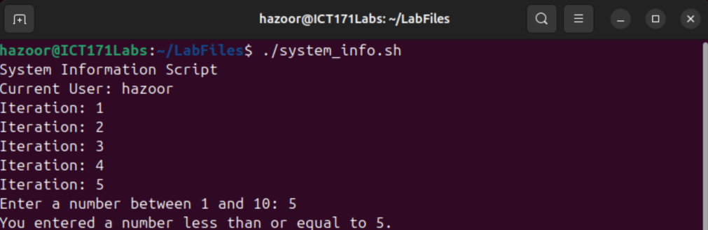

# Scripting & Automation

## Introduction to Bash

Interacting with the command line with basic commands is simple to understand. Especially with each command for one simple purpose.


- What command did you use to create a directory?
    - `mkdir`
- How can you view file content without a GUI editor?
    - `gedit <filename>`
- What is the difference between cp and mv?
    - `cp` will copy a file from one location to another.
    - `mv` will copy a file from one location to another and remove the original.

I created a hello world script using `nano` and ran it successfully.


- What is chmod +x for?
    - Allow execution of a file
- Why is #!/bin/bash used?
    - Shebang (#!) denotes a program to be used to run a script. `/bin/bash` is the location of the executable that will run the following script.
- How can you personalize script output?
    - Adding additional arguments in the script itself, which can be referenced with `$<number>` or referencing environmental variables with `$<VARNAME>`

System Information script was created and run easily as well



- How does the for loop work?
    - Sets a pivoting variable that changes across a certain range for each iteration of the loop
- What happens if number > 10?
    - The `else` clause catches it, outputting “Number out of range.”
- How could invalid input be handled more gracefully?
    - It could loop back to ask for a number until it receives a valid number using a `while` loop

System resource monitoring script also ran without problems.


### Reflections

- What does free -h show?
    - Free memory on mounted storage
- How can this script be modified to monitor network usage?
    - Using the `sar –n DEV --iface="<NetworkDeviceName>"` command to retrieve system network usage on each device
- Why is automation important for admins? 
    - Keeps systems running smoothly without extra work, automating and simplifying repetitive tasks.

## Linux Server Management Scripts


## Windows Server Management Scripts

As I use Linux, I had to install Windows in a virtual machine. Thankfully, I already had one set up.

I was able to install some plugins to allow VSCode to write PowerShell scripts. With this, I was able to write the first script for new user creation

The script named "CreateUser.ps1" was as follows:
```powershell
$Username = "NewUser"
$Password = Read-Host -AsSecureString
New-LocalUser -Name $Username -Password $Password
```
I ran this script and got the following output:
```Powershell
PowerShell 7.5.3
PS C:\Users\User> . 'C:\Users\User\Documents\WinScripts\CreateUser.ps1'
********

Name    Enabled Description
----    ------- -----------
NewUser True

PS C:\Users\User>
```

I ran the following script "JoinUserGroup.ps1" to assign the new user to a group
```powershell
Add-LocalGroupMember -Group "Users" -Member "NewUser"
```
When I ran it, it had no output at first. This seemed odd to me.
```powershell
PS C:\Users\User> . 'C:\Users\User\Documents\WinScripts\JoinUserGroup.ps1'
PS C:\Users\User>
```
So I attempted to run it again and got the following error, the first run was seemingly successful:
```powershell
PS C:\Users\User> . 'C:\Users\User\Documents\WinScripts\JoinUserGroup.ps1'
Add-LocalGroupMember: C:\Users\User\Documents\WinScripts\JoinUserGroup.ps1:1
Line |
   1 |  Add-LocalGroupMember -Group "Users" -Member "NewUser"
     |  ~~~~~~~~~~~~~~~~~~~~~~~~~~~~~~~~~~~~~~~~~~~~~~~~~~~~~
     | DESKTOP-SFM810L\NewUser is already a member of group Users.
```

I then used the script "CreateUsersCSV.ps1" to create multiple users:
```powershell
Import-Csv users.csv | ForEach-Object {
    $p = ConvertTo-SecureString $_.Password -AsPlainText -Force
    New-LocalUser -Name $_.Username -Password $p
}
```
With the following "users.csv" file in the same directory:
```
Username,Password
NewUser1,Password1
NewUser2,Password2
NewUser3,Password3
NewUser4,Password4
```
To get the following result:
```powershell
PS C:\Users\User\Documents\WinScripts> . .\CreateUsersCSV.ps1

Name     Enabled Description
----     ------- -----------
NewUser1 True
NewUser2 True
NewUser3 True
NewUser4 True

PS C:\Users\User\Documents\WinScripts>
```

I tried the command provided to check file usage >90% & only got errors
```powershell
C:\Users\User\Documents\WinScripts> Get-PSDrive -PSProvider FileSystem | Where-Object { ($_.Used / $_.Maximum) * 100 -gt 90 }
RuntimeException: Attempted to divide by zero.
RuntimeException: Attempted to divide by zero.
RuntimeException: Attempted to divide by zero.
```
I saw that this was a combination of 2 commands, `Get-PSDrive` which gets the drive information and `Where-Object` which allows selecting from specific properties of objects.
One problem this had was that the output of `Get-PSDrive -PSProvider FileSystem` did not include a `Maximum` property, only a `Used` and `Free` property.
```powershell
Name           Used (GB)     Free (GB) Provider      Root
----           ---------     --------- --------      ----
C                  16.01         47.24 FileSystem    C:\
D                                      FileSystem    D:\
Temp               16.01         47.24 FileSystem    C:\Users\User\AppData\Local\Temp\
```
Working from this, I redid the command to the one that follows.
```powershell
PS C:\Users\User\Documents\WinScripts> Get-PSDrive -PSProvider FileSystem | Where-Object { ($_.Used / ($_.Used + $_.Free)) * 100 -gt 90 }
RuntimeException: Attempted to divide by zero.
```
I still seemed to be getting a single error, but this was expected as there was a disk drive `D:` that had no storage used or free. To confirm this, I set it to test for file usage >20% and redirected error stream to null.
```
PS C:\Users\User\Documents\WinScripts> Get-PSDrive -PSProvider FileSystem | Where-Object { ($_.Used / ($_.Used + $_.Free)) * 100 -gt 20 } 2> $null

Name           Used (GB)     Free (GB) Provider      Root
----           ---------     --------- --------      ----
C                  21.42         41.83 FileSystem    C:\
Temp               21.42         41.83 FileSystem    C:\Users\User\AppData\Local\Temp\
```
Which ran successfully as expected.

For resource usage, I first tried the command to check the top 10 memory usage processes, which ran smoothly as expected:
```powershell
PS C:\Users> Get-Process | Sort-Object WorkingSet -Descending | Select -First 10

 NPM(K)    PM(M)      WS(M)     CPU(s)      Id  SI ProcessName
 ------    -----      -----     ------      --  -- -----------
     62   292.28     349.88      41.28    1352   1 Code
     96   307.15     310.35      11.61    8116   1 powershell
    232   296.00     258.04     264.77    2752   0 MsMpEng
    109    90.89     256.14      24.98    3948   1 explorer
     35   220.68     223.40      15.98    4396   1 Code
      0     0.66     206.96       3.45    1972   0 Memory Compression
     82   106.44     145.11      75.84    1152   1 dwm
     97    61.32     145.02      10.84    4980   1 pwsh
     40   108.77     128.93       2.02    4232   1 powershell
    136   151.10     127.98      11.09    4880   1 SearchHost
```
I tried the same for processor usage and got the following output:
```powershell
PS C:\Users> Get-Process | Sort-Object CPU -Descending | Select -First 10

 NPM(K)    PM(M)      WS(M)     CPU(s)      Id  SI ProcessName
 ------    -----      -----     ------      --  -- -----------
     64   180.79     119.00   1,022.06    1168   0 svchost
      0     0.05       1.27     324.56       4   0 System
    232   294.88     255.48     265.64    2752   0 MsMpEng
     26    83.16     106.37     114.56    1276   0 svchost
     82   106.34     145.02      76.62    1152   1 dwm
     62   291.89     349.50      41.28    1352   1 Code
     20     6.79      23.32      40.03    3836   0 svchost
    109    91.08     256.30      25.02    3948   1 explorer
     57   107.12     119.07      16.70    5716   1 Code
     35   220.68     223.41      15.98    4396   1 Code
```

I checked the open listening ports on my device, and found the following:
```powershell
PS C:\Users> Get-NetTCPConnection | Where-Object State -eq "Listen"

LocalAddress                        LocalPort RemoteAddress                       RemotePort State       AppliedSetting OwningProcess
------------                        --------- -------------                       ---------- -----       -------------- -------------
::                                  49669     ::                                  0          Listen                     844
::                                  49668     ::                                  0          Listen                     2352
::                                  49667     ::                                  0          Listen                     1176
::                                  49666     ::                                  0          Listen                     1168
::                                  49665     ::                                  0          Listen                     712
::                                  49664     ::                                  0          Listen                     856
::                                  7680      ::                                  0          Listen                     3836
::                                  445       ::                                  0          Listen                     4
::                                  135       ::                                  0          Listen                     632
0.0.0.0                             49669     0.0.0.0                             0          Listen                     844
0.0.0.0                             49668     0.0.0.0                             0          Listen                     2352
0.0.0.0                             49667     0.0.0.0                             0          Listen                     1176
0.0.0.0                             49666     0.0.0.0                             0          Listen                     1168
0.0.0.0                             49665     0.0.0.0                             0          Listen                     712
0.0.0.0                             49664     0.0.0.0                             0          Listen                     856
0.0.0.0                             5040      0.0.0.0                             0          Listen                     1436
192.168.122.183                     139       0.0.0.0                             0          Listen                     4
0.0.0.0                             135       0.0.0.0                             0          Listen                     632
```
I retrieved a snapshot of network usage with the following command:
```powershell
PS C:\Users> Get-NetAdapterStatistics | Select Name, ReceivedBytes, SentBytes

Name                ReceivedBytes SentBytes
----                ------------- ---------
Ethernet Instance 0    2709212774  54752143
```

I tried to backup system events but had some trouble due to a missing directory in the command recommended, so I created a `Backups` directory in the `C:` drive to store them and re-ran the command
```powershell
PS C:\Users> wevtutil epl System "C:\Backups\System.evtx"
Failed to export log System.
The system cannot find the path specified.
PS C:\Users> mkdir C:\Backups

    Directory: C:\

Mode                 LastWriteTime         Length Name
----                 -------------         ------ ----
d----           10/1/2025 12:51 AM                Backups

PS C:\Users> wevtutil epl System "C:\Backups\System.evtx"
PS C:\Users> dir C:\Backups

    Directory: C:\Backups

Mode                 LastWriteTime         Length Name
----                 -------------         ------ ----
-a---           10/1/2025 12:51 AM        1118208 System.evtx
```

I was able to compress my windows scripts into an archive and save them to the backups directory
```powershell
PS C:\Users> Compress-Archive -Path "C:\Users\User\Documents\WinScripts" -DestinationPath "C:\Backups\WinScripts.zip"
PS C:\Users> ls C:\Backups\

    Directory: C:\Backups

Mode                 LastWriteTime         Length Name
----                 -------------         ------ ----
-a---           10/1/2025 12:51 AM        1118208 System.evtx
-a---           10/1/2025 12:56 AM            841 WinScripts.zip
```

I tested my network connection by pinging google's DNS server and example.com
```powershell
PS C:\Users> foreach ($s in "8.8.8.8","example.com") {
>>   if (Test-Connection $s -Count 1 -Quiet) { "$s OK" } else { "$s FAIL" }
>> }
8.8.8.8 OK
example.com OK
```
