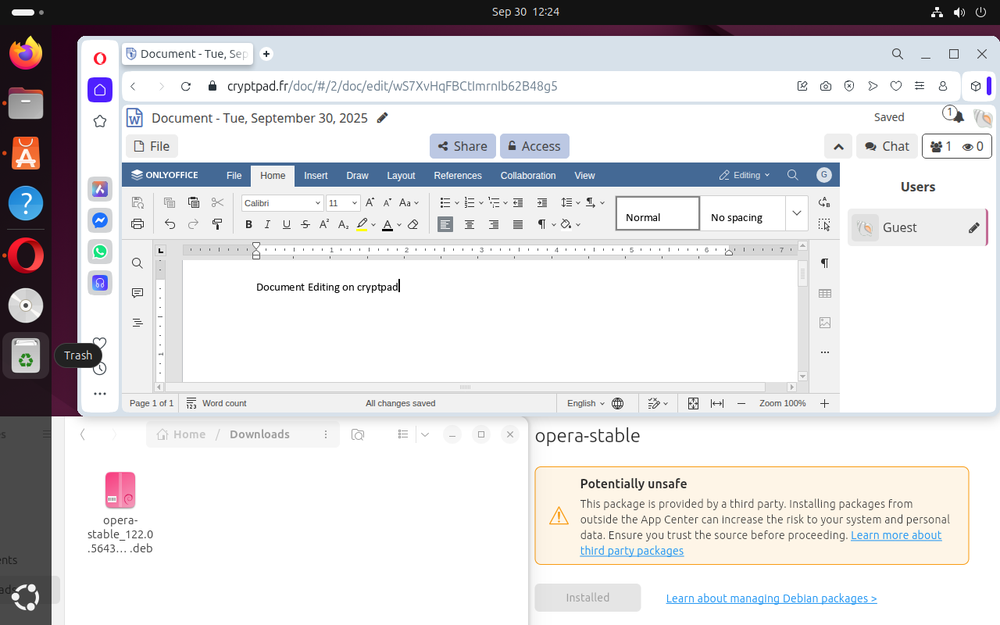

# Ubuntu Desktop and Command Line Familiarization

I was able to run applications on Ubuntu. Web browsing worked fine, as shown below with DuckDuckGo. I also installed LibreOffice through the app center & was able to use it to create a document.


I tried running a few commands, getting the following outputs for each

```
hazoor@ICT171Labs:~$ ps -e
    PID TTY          TIME CMD
      1 ?        00:00:02 systemd
      2 ?        00:00:00 kthreadd
      3 ?        00:00:00 pool_workqueue_release
      4 ?        00:00:00 kworker/R-rcu_gp
      5 ?        00:00:00 kworker/R-sync_wq
      6 ?        00:00:00 kworker/R-kvfree_rcu_reclaim
      7 ?        00:00:00 kworker/R-slub_flushwq
      8 ?        00:00:00 kworker/R-netns
     10 ?        00:00:00 kworker/0:0H-events_highpri
     12 ?        00:00:00 kworker/u16:0-ipv6_addrconf
     13 ?        00:00:00 kworker/R-mm_percpu_wq
     14 ?        00:00:00 rcu_tasks_kthread
     15 ?        00:00:00 rcu_tasks_rude_kthread
     16 ?        00:00:00 rcu_tasks_trace_kthread
     17 ?        00:00:00 ksoftirqd/0
     18 ?        00:00:00 rcu_preempt
     19 ?        00:00:00 rcu_exp_par_gp_kthread_worker/0
     20 ?        00:00:00 rcu_exp_gp_kthread_worker
     21 ?        00:00:00 migration/0
     22 ?        00:00:00 idle_inject/0
     23 ?        00:00:00 cpuhp/0
     24 ?        00:00:00 cpuhp/1
     25 ?        00:00:00 idle_inject/1
     26 ?        00:00:00 migration/1
...
```
`ps -e` lists running every running process so it is a longer list than can be reasonably put into this document. This is only a small portion of it. Notably, systemd is the first program run with PID 1.

```
hazoor@ICT171Labs:~$ top
top - 11:25:26 up  1:30,  2 users,  load average: 0.02, 0.20, 0.21
Tasks: 249 total,   1 running, 248 sleeping,   0 stopped,   0 zombie
%Cpu(s):  0.4 us,  0.3 sy,  0.0 ni, 99.3 id,  0.0 wa,  0.0 hi,  0.0 si,  0.0 st 
MiB Mem :   3915.8 total,   1270.4 free,   1223.4 used,   1713.7 buff/cache     
MiB Swap:   3914.0 total,   3913.5 free,      0.5 used.   2692.4 avail Mem 

    PID USER      PR  NI    VIRT    RES    SHR S  %CPU  %MEM     TIME+ COMMAND  
   2195 hazoor    20   0 4877824 433832 147812 S   3.0  10.8   1:25.90 gnome-s+ 
   1844 root      20   0  160256   4380   3996 S   0.7   0.1   0:01.79 spice-v+ 
   8005 hazoor    20   0  624748  56120  44296 S   0.7   1.4   0:00.63 gnome-t+ 
   8025 hazoor    20   0   14536   5988   3812 R   0.3   0.1   0:00.02 top      
      1 root      20   0   23372  14512   9520 S   0.0   0.4   0:02.41 systemd  
      2 root      20   0       0      0      0 S   0.0   0.0   0:00.00 kthreadd 
      3 root      20   0       0      0      0 S   0.0   0.0   0:00.00 pool_wo+ 
      4 root       0 -20       0      0      0 I   0.0   0.0   0:00.00 kworker+ 
      5 root       0 -20       0      0      0 I   0.0   0.0   0:00.00 kworker+ 
      6 root       0 -20       0      0      0 I   0.0   0.0   0:00.00 kworker+ 
      7 root       0 -20       0      0      0 I   0.0   0.0   0:00.00 kworker+ 
      8 root       0 -20       0      0      0 I   0.0   0.0   0:00.00 kworker+ 
     10 root       0 -20       0      0      0 I   0.0   0.0   0:00.00 kworker+ 
     12 root      20   0       0      0      0 I   0.0   0.0   0:00.00 kworker+ 
     13 root       0 -20       0      0      0 I   0.0   0.0   0:00.00 kworker+ 
     14 root      20   0       0      0      0 I   0.0   0.0   0:00.00 rcu_tas+ 
     15 root      20   0       0      0      0 I   0.0   0.0   0:00.00 rcu_tas+ 
```
`top` allowed me to view running processes along with the active resource usage. I quit the program with `q`

```
hazoor@ICT171Labs:~$ ls          
Desktop     Music       snap
Documents   Pictures    Templates
Downloads   Public      Videos
hazoor@ICT171Labs:~$ ls -la
total 1264
drwxr-x--- 19 hazoor hazoor    4096 Sep 28 17:05 .
drwxr-xr-x  7 root   root      4096 Sep 28 17:59 ..
-rw-------  1 hazoor hazoor    8833 Sep 30 11:11 .bash_history
-rw-r--r--  1 hazoor hazoor     220 Mar 31  2024 .bash_logout
-rw-r--r--  1 hazoor hazoor    3771 Mar 31  2024 .bashrc
drwx------ 14 hazoor hazoor    4096 Sep 27 14:51 .cache
drwx------ 19 hazoor hazoor    4096 Sep 28 14:28 .config
drwxr-xr-x  2 hazoor hazoor    4096 Sep 30 11:11 Desktop
drwxr-xr-x  2 hazoor hazoor    4096 Sep 30 11:21 Documents
drwxr-xr-x  2 hazoor hazoor    4096 Sep 27 17:55 Downloads
drwx------  2 hazoor hazoor    4096 Sep 30 11:16 .gnupg
-rw-------  1 hazoor hazoor      60 Sep 28 16:53 .lesshst
drwx------  4 hazoor hazoor    4096 Sep 27 12:17 .local
drwxr-xr-x  2 hazoor hazoor    4096 Sep 27 12:17 Music
drwxr-xr-x  2 hazoor hazoor    4096 Sep 27 12:17 Pictures
drwx------  3 hazoor hazoor    4096 Sep 27 12:48 .pki
-rw-r--r--  1 hazoor hazoor     807 Mar 31  2024 .profile
drwxr-xr-x  2 hazoor hazoor    4096 Sep 27 12:17 Public
drwx------  7 hazoor hazoor    4096 Sep 30 11:16 snap
drwx------  2 hazoor hazoor    4096 Sep 28 14:32 .ssh
-rw-r--r--  1 hazoor hazoor       0 Sep 27 12:20 .sudo_as_admin_successful
drwxr-xr-x  2 hazoor hazoor    4096 Sep 27 12:17 Templates
drwxr-xr-x  2 hazoor hazoor    4096 Sep 27 12:17 Videos
-rw-------  1 hazoor hazoor   11313 Sep 28 17:05 .viminfo
hazoor@ICT171Labs:~$ ls -alt
total 1264
drwxr-xr-x  2 hazoor hazoor    4096 Sep 30 11:21 Documents
drwx------  7 hazoor hazoor    4096 Sep 30 11:16 snap
drwx------  2 hazoor hazoor    4096 Sep 30 11:16 .gnupg
-rw-------  1 hazoor hazoor    8833 Sep 30 11:11 .bash_history
drwxr-xr-x  2 hazoor hazoor    4096 Sep 30 11:11 Desktop
drwxr-xr-x  7 root   root      4096 Sep 28 17:59 ..
drwxr-x--- 19 hazoor hazoor    4096 Sep 28 17:05 .
-rw-------  1 hazoor hazoor   11313 Sep 28 17:05 .viminfo
-rw-------  1 hazoor hazoor      60 Sep 28 16:53 .lesshst
drwx------  2 hazoor hazoor    4096 Sep 28 14:32 .ssh
drwx------ 19 hazoor hazoor    4096 Sep 28 14:28 .config
drwxr-xr-x  2 hazoor hazoor    4096 Sep 27 17:55 Downloads
drwx------ 14 hazoor hazoor    4096 Sep 27 14:51 .cache
drwx------  3 hazoor hazoor    4096 Sep 27 12:48 .pki
-rw-r--r--  1 hazoor hazoor       0 Sep 27 12:20 .sudo_as_admin_successful
drwxr-xr-x  2 hazoor hazoor    4096 Sep 27 12:17 Music
drwxr-xr-x  2 hazoor hazoor    4096 Sep 27 12:17 Pictures
drwxr-xr-x  2 hazoor hazoor    4096 Sep 27 12:17 Public
drwxr-xr-x  2 hazoor hazoor    4096 Sep 27 12:17 Templates
drwxr-xr-x  2 hazoor hazoor    4096 Sep 27 12:17 Videos
drwx------  4 hazoor hazoor    4096 Sep 27 12:17 .local
-rw-r--r--  1 hazoor hazoor     220 Mar 31  2024 .bash_logout
-rw-r--r--  1 hazoor hazoor    3771 Mar 31  2024 .bashrc
-rw-r--r--  1 hazoor hazoor     807 Mar 31  2024 .profile
```
As per the man page, the `ls` command is used to list files and directories. The `ls` command greatly varies with switches. The base command itself lists all files and directories not starting with a period. The `-a` switch allows the command to display directories and files that start with a period. The `-l` switch enables “long list” form which shows permissions, hard links, owner, owner group, file size, and last edited date/time. The `-t` switch sorts by last edited date/time.

```
hazoor@ICT171Labs:~$ touch testfile.txt 
hazoor@ICT171Labs:~$ nano testfile.txt 
hazoor@ICT171Labs:~$ cat testfile.txt 
Testing
Text
File
hazoor@ICT171Labs:~$ 
```
I was able to create & edit a file via the command line


However I faced the following error when trying to edit the file with a graphical text editor:

```
hazoor@ICT171Labs:~$ gedit testfile.txt 
Command 'gedit' not found, but can be installed with:
sudo snap install gedit  # version 48.1, or
sudo apt  install gedit  # version 46.1-3
See 'snap info gedit' for additional versions.
```

So I tried installing gedit, and was then able to edit the file.

```
hazoor@ICT171Labs:~$ sudo apt install gedit
Reading package lists... Done
Building dependency tree... Done
Reading state information... Done
Suggested packages:
  gedit-plugins
The following NEW packages will be installed:
  gedit
0 upgraded, 1 newly installed, 0 to remove and 1 not upgraded.
Need to get 356 kB of archives.
After this operation, 1,553 kB of additional disk space will be used.
Get:1 http://sg.archive.ubuntu.com/ubuntu noble/universe amd64 gedit amd64 46.2-2 [356 kB]
Fetched 356 kB in 8s (44.6 kB/s)
Selecting previously unselected package gedit.
(Reading database ... 166296 files and directories currently installed.)
Preparing to unpack .../gedit_46.2-2_amd64.deb ...
Unpacking gedit (46.2-2) ...
Setting up gedit (46.2-2) ...
/usr/lib/x86_64-linux-gnu/gedit/plugins/externaltools/library.py:212: SyntaxWarning: invalid escape sequence '\-'
  RE_KEY = re.compile('^([a-zA-Z_][a-zA-Z0-9_.\-]*)(\[([a-zA-Z_@]+)\])?$')
/usr/lib/x86_64-linux-gnu/gedit/plugins/snippets/substitutionparser.py:162: Synt
axWarning: invalid escape sequence '\s'
  match = re.match('\\\\?%s\s*' % self.REG_GROUP, tokens)
Processing triggers for desktop-file-utils (0.27-2build1) ...
Processing triggers for gnome-menus (3.36.0-1.1ubuntu3) ...
hazoor@ICT171Labs:~$ gedit testfile.txt 
```


I was able to move, copy, and remove files with standard commands.

```
hazoor@ICT171Labs:~$ mv testfile.txt Documents/
hazoor@ICT171Labs:~$ cd Documents/
hazoor@ICT171Labs:~/Documents$ ls -lah
total 24K
drwxr-xr-x  2 hazoor hazoor 4.0K Sep 30 11:48 .
drwxr-x--- 19 hazoor hazoor 4.0K Sep 30 11:48 ..
-rw-rw-r--  1 hazoor hazoor 9.7K Sep 30 11:17 Hello.odt
-rw-rw-r--  1 hazoor hazoor   27 Sep 30 11:47 testfile.txt
hazoor@ICT171Labs:~/Documents$ cp testfile.txt testfile2.txt 
hazoor@ICT171Labs:~/Documents$ ls -lah
total 28K
drwxr-xr-x  2 hazoor hazoor 4.0K Sep 30 11:48 .
drwxr-x--- 19 hazoor hazoor 4.0K Sep 30 11:48 ..
-rw-rw-r--  1 hazoor hazoor 9.7K Sep 30 11:17 Hello.odt
-rw-rw-r--  1 hazoor hazoor   27 Sep 30 11:48 testfile2.txt
-rw-rw-r--  1 hazoor hazoor   27 Sep 30 11:47 testfile.txt
hazoor@ICT171Labs:~/Documents$ rm testfile.txt 
hazoor@ICT171Labs:~/Documents$ cat testfile2.txt 
Testing
Text
File
Success!
hazoor@ICT171Labs:~/Documents$ 
```

I was able to collect the following system information with commands:

```
hazoor@ICT171Labs:~/Documents$ uname -a
Linux ICT171Labs 6.14.0-32-generic #32~24.04.1-Ubuntu SMP PREEMPT_DYNAMIC Tue Sep  2 14:21:04 UTC 2 x86_64 x86_64 x86_64 GNU/Linux
hazoor@ICT171Labs:~/Documents$ lsb_release -a
No LSB modules are available.
Distributor ID:	Ubuntu
Description:	Ubuntu 24.04.3 LTS
Release:	24.04
Codename:	noble
hazoor@ICT171Labs:~/Documents$ hostnamectl
 Static hostname: ICT171Labs
       Icon name: computer-vm
         Chassis: vm \U0001f5b4
      Machine ID: 971b1e53b1034d08ac00fdfe89767e95
         Boot ID: 4eb7c0d6341e483cab88aa4e41a1811a
  Virtualization: kvm
Operating System: Ubuntu 24.04.3 LTS              
          Kernel: Linux 6.14.0-32-generic
    Architecture: x86-64
 Hardware Vendor: QEMU
  Hardware Model: Standard PC _Q35 + ICH9, 2009_
Firmware Version: Arch Linux 1.17.0-1-1
   Firmware Date: Tue 2014-04-01
    Firmware Age: 11y 5month 4w 2d                
hazoor@ICT171Labs:~/Documents$ cat /proc/cpuinfo 
processor	: 0
vendor_id	: AuthenticAMD
cpu family	: 25
model		: 117
model name	: AMD Ryzen 7 PRO 8840U w/ Radeon 780M Graphics
stepping	: 2
microcode	: 0xa70520a
cpu MHz		: 3293.810
cache size	: 512 KB
physical id	: 0
siblings	: 1
core id		: 0
cpu cores	: 1
apicid		: 0
initial apicid	: 0
fpu		: yes
fpu_exception	: yes
cpuid level	: 16
wp		: yes
												<snip>
bugs		: sysret_ss_attrs spectre_v1 spectre_v2 spec_store_bypass srso ibpb_no_ret
bogomips	: 6587.62
TLB size	: 1024 4K pages
clflush size	: 64
cache_alignment	: 64
address sizes	: 48 bits physical, 48 bits virtual
power management:


```
(The output for `cat /proc/cpuinfo` was very long and so has been snipped with `<snip>` in its place.)

As per the error, only root is able to add new users and sudo allows a user to act as root
```
hazoor@ICT171Labs:~$ whoami
hazoor
hazoor@ICT171Labs:~$ sudo whoami
root
hazoor@ICT171Labs:~$ adduser newuser
fatal: Only root may add a user or group to the system.
hazoor@ICT171Labs:~$ sudo adduser newuser
info: Adding user `newuser' ...
info: Selecting UID/GID from range 1000 to 59999 ...
info: Adding new group `newuser' (1002) ...
info: Adding new user `newuser' (1002) with group `newuser (1002)' ...
info: Creating home directory `/home/newuser' ...
info: Copying files from `/etc/skel' ...
New password: 
BAD PASSWORD: The password is shorter than 8 characters
Retype new password: 
passwd: password updated successfully
Changing the user information for newuser
Enter the new value, or press ENTER for the default
	Full Name []: 
	Room Number []: 
	Work Phone []: 
	Home Phone []: 
	Other []: 
Is the information correct? [Y/n] 
info: Adding new user `newuser' to supplemental / extra groups `users' ...
info: Adding user `newuser' to group `users' ...
hazoor@ICT171Labs:~$ 
```

The default IP configuration was correct and allowed me to ping Google
```
hazoor@ICT171Labs:~$ ip a
1: lo: <LOOPBACK,UP,LOWER_UP> mtu 65536 qdisc noqueue state UNKNOWN group default qlen 1000
    link/loopback 00:00:00:00:00:00 brd 00:00:00:00:00:00
    inet 127.0.0.1/8 scope host lo
       valid_lft forever preferred_lft forever
    inet6 ::1/128 scope host noprefixroute 
       valid_lft forever preferred_lft forever
2: enp1s0: <BROADCAST,MULTICAST,UP,LOWER_UP> mtu 1500 qdisc fq_codel state UP group default qlen 1000
    link/ether 52:54:00:d2:9c:93 brd ff:ff:ff:ff:ff:ff
    inet 192.168.122.195/24 brd 192.168.122.255 scope global dynamic noprefixroute enp1s0
       valid_lft 3485sec preferred_lft 3485sec
    inet6 fe80::5054:ff:fed2:9c93/64 scope link 
       valid_lft forever preferred_lft forever
hazoor@ICT171Labs:~$ ping 8.8.8.8
PING 8.8.8.8 (8.8.8.8) 56(84) bytes of data.
64 bytes from 8.8.8.8: icmp_seq=1 ttl=114 time=101 ms
64 bytes from 8.8.8.8: icmp_seq=2 ttl=114 time=100 ms
64 bytes from 8.8.8.8: icmp_seq=3 ttl=114 time=101 ms
64 bytes from 8.8.8.8: icmp_seq=4 ttl=114 time=96.3 ms
64 bytes from 8.8.8.8: icmp_seq=5 ttl=114 time=101 ms
64 bytes from 8.8.8.8: icmp_seq=6 ttl=114 time=103 ms
64 bytes from 8.8.8.8: icmp_seq=7 ttl=114 time=103 ms
64 bytes from 8.8.8.8: icmp_seq=8 ttl=114 time=88.4 ms
64 bytes from 8.8.8.8: icmp_seq=9 ttl=114 time=103 ms
64 bytes from 8.8.8.8: icmp_seq=10 ttl=114 time=103 ms
64 bytes from 8.8.8.8: icmp_seq=11 ttl=114 time=103 ms
64 bytes from 8.8.8.8: icmp_seq=12 ttl=114 time=88.6 ms
64 bytes from 8.8.8.8: icmp_seq=13 ttl=114 time=101 ms
64 bytes from 8.8.8.8: icmp_seq=14 ttl=114 time=101 ms
64 bytes from 8.8.8.8: icmp_seq=15 ttl=114 time=102 ms
^C
--- 8.8.8.8 ping statistics ---
15 packets transmitted, 15 received, 0% packet loss, time 14020ms
rtt min/avg/max/mdev = 88.448/99.642/103.320/4.665 ms
```
I tried to add `GoogleEpicDNS` as a hostname to /etc/hosts but `nano` warned me that I could only read the file, so I re-ran the command with `sudo` and edited the file.

After editing the /etc/hosts file, it looked like so:
```
127.0.0.1 localhost
127.0.1.1 ICT171Labs

# The following lines are desirable for IPv6 capable hosts
::1     ip6-localhost ip6-loopback
fe00::0 ip6-localnet
ff00::0 ip6-mcastprefix
ff02::1 ip6-allnodes
ff02::2 ip6-allrouters

8.8.8.8 GoogleEpicDNS
```

Which then allowed me to ping GoogleEpicDNS hostname
```
hazoor@ICT171Labs:~$ ping GoogleEpicDNS
PING GoogleEpicDNS (8.8.8.8) 56(84) bytes of data.
64 bytes from GoogleEpicDNS (8.8.8.8): icmp_seq=1 ttl=114 time=101 ms
64 bytes from GoogleEpicDNS (8.8.8.8): icmp_seq=2 ttl=114 time=101 ms
64 bytes from GoogleEpicDNS (8.8.8.8): icmp_seq=3 ttl=114 time=103 ms
64 bytes from GoogleEpicDNS (8.8.8.8): icmp_seq=4 ttl=114 time=88.2 ms
64 bytes from GoogleEpicDNS (8.8.8.8): icmp_seq=5 ttl=114 time=89.1 ms
64 bytes from GoogleEpicDNS (8.8.8.8): icmp_seq=6 ttl=114 time=101 ms
^C
--- GoogleEpicDNS ping statistics ---
6 packets transmitted, 6 received, 0% packet loss, time 5006ms
rtt min/avg/max/mdev = 88.150/97.189/102.901/6.088 ms
```

I was able to look up information about google with the `nslookup` and `whois` commands.

```
hazoor@ICT171Labs:~$ nslookup google.com
Server:		127.0.0.53
Address:	127.0.0.53#53

Non-authoritative answer:
Name:	google.com
Address: 142.250.70.142
Name:	google.com
Address: 2404:6800:4015:800::200e

hazoor@ICT171Labs:~$ whois google.com
   Domain Name: GOOGLE.COM
   Registry Domain ID: 2138514_DOMAIN_COM-VRSN
   Registrar WHOIS Server: whois.markmonitor.com
   Registrar URL: http://www.markmonitor.com
   Updated Date: 2019-09-09T15:39:04Z
   Creation Date: 1997-09-15T04:00:00Z
   Registry Expiry Date: 2028-09-14T04:00:00Z
   Registrar: MarkMonitor Inc.
   Registrar IANA ID: 292
   Registrar Abuse Contact Email: abusecomplaints@markmonitor.com
   Registrar Abuse Contact Phone: +1.2086851750
   Domain Status: clientDeleteProhibited https://icann.org/epp#clientDeleteProhibited
   Domain Status: clientTransferProhibited https://icann.org/epp#clientTransferProhibited
   Domain Status: clientUpdateProhibited https://icann.org/epp#clientUpdateProhibited
   Domain Status: serverDeleteProhibited https://icann.org/epp#serverDeleteProhibited
   Domain Status: serverTransferProhibited https://icann.org/epp#serverTransferProhibited
   Domain Status: serverUpdateProhibited https://icann.org/epp#serverUpdateProhibited
   Name Server: NS1.GOOGLE.COM
   Name Server: NS2.GOOGLE.COM
   Name Server: NS3.GOOGLE.COM
   Name Server: NS4.GOOGLE.COM
   DNSSEC: unsigned
   URL of the ICANN Whois Inaccuracy Complaint Form: https://www.icann.org/wicf/
>>> Last update of whois database: 2025-09-30T04:01:39Z <<<
```

I looked up my local ip with `ip a` and found my public address with https://whatsmyipaddress.com. These are different due to my computer being behind a NAT gateway (my home router). My local connections go to my router and get translated to the address provided by my ISP with a temporarily assigned ephemeral port for communication outside my home network.


I retrieved the following hardware information from commands:

```
hazoor@ICT171Labs:~$ lsusb
Bus 001 Device 001: ID 1d6b:0002 Linux Foundation 2.0 root hub
Bus 001 Device 002: ID 0627:0001 Adomax Technology Co., Ltd QEMU Tablet
Bus 002 Device 001: ID 1d6b:0003 Linux Foundation 3.0 root hub
hazoor@ICT171Labs:~$ lspci
00:00.0 Host bridge: Intel Corporation 82G33/G31/P35/P31 Express DRAM Controller
00:01.0 VGA compatible controller: Red Hat, Inc. Virtio 1.0 GPU (rev 01)
00:02.0 PCI bridge: Red Hat, Inc. QEMU PCIe Root port
00:02.1 PCI bridge: Red Hat, Inc. QEMU PCIe Root port
00:02.2 PCI bridge: Red Hat, Inc. QEMU PCIe Root port
00:02.3 PCI bridge: Red Hat, Inc. QEMU PCIe Root port
00:02.4 PCI bridge: Red Hat, Inc. QEMU PCIe Root port
00:02.5 PCI bridge: Red Hat, Inc. QEMU PCIe Root port
00:02.6 PCI bridge: Red Hat, Inc. QEMU PCIe Root port
00:02.7 PCI bridge: Red Hat, Inc. QEMU PCIe Root port
00:03.0 PCI bridge: Red Hat, Inc. QEMU PCIe Root port
00:03.1 PCI bridge: Red Hat, Inc. QEMU PCIe Root port
00:03.2 PCI bridge: Red Hat, Inc. QEMU PCIe Root port
00:03.3 PCI bridge: Red Hat, Inc. QEMU PCIe Root port
00:03.4 PCI bridge: Red Hat, Inc. QEMU PCIe Root port
00:03.5 PCI bridge: Red Hat, Inc. QEMU PCIe Root port
00:1b.0 Audio device: Intel Corporation 82801I (ICH9 Family) HD Audio Controller (rev 03)
00:1f.0 ISA bridge: Intel Corporation 82801IB (ICH9) LPC Interface Controller (rev 02)
00:1f.2 SATA controller: Intel Corporation 82801IR/IO/IH (ICH9R/DO/DH) 6 port SATA Controller [AHCI mode] (rev 02)
00:1f.3 SMBus: Intel Corporation 82801I (ICH9 Family) SMBus Controller (rev 02)
01:00.0 Ethernet controller: Red Hat, Inc. Virtio 1.0 network device (rev 01)
02:00.0 USB controller: Red Hat, Inc. QEMU XHCI Host Controller (rev 01)
03:00.0 Communication controller: Red Hat, Inc. Virtio 1.0 console (rev 01)
04:00.0 SCSI storage controller: Red Hat, Inc. Virtio 1.0 block device (rev 01)
05:00.0 Unclassified device [00ff]: Red Hat, Inc. Virtio 1.0 memory balloon (rev 01)
06:00.0 Unclassified device [00ff]: Red Hat, Inc. Virtio 1.0 RNG (rev 01)
```

```
hazoor@ICT171Labs:~$ less /proc/cpuinfo
processor       : 0
vendor_id       : AuthenticAMD
cpu family      : 25
model           : 117
model name      : AMD Ryzen 7 PRO 8840U w/ Radeon 780M Graphics
stepping        : 2
microcode       : 0xa70520a
cpu MHz         : 3293.810
cache size      : 512 KB
physical id     : 0
siblings        : 1
core id         : 0
cpu cores       : 1
apicid          : 0
initial apicid  : 0
fpu             : yes
fpu_exception   : yes
cpuid level     : 16
wp              : yes
flags           : fpu vme de pse tsc msr pae mce cx8 apic sep mtrr pge mca cmov pat pse36 clflush mmx fxsr sse sse2 sys
call nx mmxext fxsr_opt pdpe1gb rdtscp lm rep_good nopl cpuid extd_apicid tsc_known_freq pni pclmulqdq ssse3 fma cx16 s
se4_1 sse4_2 x2apic movbe popcnt tsc_deadline_timer aes xsave avx f16c rdrand hypervisor lahf_lm cmp_legacy svm cr8_leg
acy abm sse4a misalignsse 3dnowprefetch osvw perfctr_core ssbd perfmon_v2 ibrs ibpb stibp ibrs_enhanced vmmcall fsgsbas
```

The following details were copied directly from the System Details (with the provided “copy” button):
```md
# System Details Report
---

## Report details
- **Date generated:**                              2025-09-30 12:12:28

## Hardware Information:
- **Hardware Model:**                              QEMU Standard PC \_Q35 + ICH9, 2009\_
- **Memory:**                                      4.0 GiB
- **Processor:**                                   AMD Ryzen™ 7 PRO 8840U w/ Radeon™ 780M Graphics × 4
- **Graphics:**                                    Software Rendering
- **Disk Capacity:**                               68.7 GB

## Software Information:
- **Firmware Version:**                            Arch Linux 1.17.0-1-1
- **OS Name:**                                     Ubuntu 24.04.3 LTS
- **OS Build:**                                    (null)
- **OS Type:**                                     64-bit
- **GNOME Version:**                               46
- **Windowing System:**                            Wayland
- **Kernel Version:**                              Linux 6.14.0-32-generic
```
The command line tools provide far more details, with the GUI providing a quick overview.

I was able to capture into a file then remove the output of `lsusb`
```
hazoor@ICT171Labs:~$ lsusb > output_of_lsusb
hazoor@ICT171Labs:~$ cat output_of_lsusb 
Bus 001 Device 001: ID 1d6b:0002 Linux Foundation 2.0 root hub
Bus 001 Device 002: ID 0627:0001 Adomax Technology Co., Ltd QEMU Tablet
Bus 002 Device 001: ID 1d6b:0003 Linux Foundation 3.0 root hub
hazoor@ICT171Labs:~$ rm output_of_lsusb 
```

I installed opera through a .deb downloaded from the official website to open & edit documents on SaaS website https://crytpad.fr.



I was able to use the software center to install and use Kolourpaint very quickly, not even requiring a setup wizard just a single-click install.


I ran an update, but I found that ubuntu automatically updated my packages.
```
hazoor@ICT171Labs:~$ sudo apt update && sudo apt upgrade
Hit:1 http://sg.archive.ubuntu.com/ubuntu noble InRelease
Hit:2 http://sg.archive.ubuntu.com/ubuntu noble-updates InRelease
Hit:3 http://sg.archive.ubuntu.com/ubuntu noble-backports InRelease
Hit:4 https://deb.opera.com/opera-stable stable InRelease
Hit:5 http://security.ubuntu.com/ubuntu noble-security InRelease
Reading package lists... Done
Building dependency tree... Done
Reading state information... Done
All packages are up to date.
Reading package lists... Done
Building dependency tree... Done
Reading state information... Done
Calculating upgrade... Done
Get more security updates through Ubuntu Pro with 'esm-apps' enabled:
  libzvbi-common libcjson1 libpostproc57 libavcodec60
  libgstreamer-plugins-bad1.0-0 libzvbi0t64 libavutil58 libswscale7
  libswresample4 libavformat60 python3-tqdm libavfilter9
Learn more about Ubuntu Pro at https://ubuntu.com/pro
0 upgraded, 0 newly installed, 0 to remove and 0 not upgraded.
```

I proceeded to install and run VLC so I would be able to access media in my VM


I installed build-essential and compiled Hello World from source code
```

hazoor@ICT171Labs:~$ nano hello_world.c
hazoor@ICT171Labs:~$ ls -l hello_world.c
-rw-rw-r-- 1 hazoor hazoor 130 Sep 30 13:32 hello_world.c
hazoor@ICT171Labs:~$ cat hello_world.c
#include <stdio.h>
int main() {
   // printf() displays the string inside quotation
   printf("Hello, World!\n");
   return 0;
}

hazoor@ICT171Labs:~$ gcc hello_world.c -o hello_world_executable
hazoor@ICT171Labs:~$ chmod 755 hello_world_executable
hazoor@ICT171Labs:~$ ls -l hello_world_executable 
-rwxr-xr-x 1 hazoor hazoor 15968 Sep 30 13:33 hello_world_executable
hazoor@ICT171Labs:~$ ./hello_world_executable 
Hello, World!
hazoor@ICT171Labs:~$ 
```

## Reflection

Graphical User Interfaces (or GUI) is the most common interface type today. In contrast, the Command Line Interface (CLI) often reminds most people of Unix and DOS era computers. Despite its associations with archaic devices, it has persisted as the barest and often most efficient way of interacting with a computer. CLIs often allow for more programmatic considerations such as scripting and automation. They can also often be much faster than GUI applications. Personally, my preference lies in both depending on use case. For minimal resource usage, scripting, or certain efficiency requirements, CLI is preferable. For more comfort and familiar user experience, the GUI is preferable.

For software installation, there are three main methods. SaaS is the simplest, allowing users with a web browser to just go to the website to access it. However, the trade-off is that it is unusable offline and has performance costs. The App Center & package manager allows for simple software installation, with pre-built binaries and automatic dependency resolution. This has mostly negligible performance costs and is more familiar to users of other operating systems. It has the added benefit of being vetted by the distribution's developers, allowing more confidence and security. Manual installations are similar if installing from .deb or .rpm files as they often include their dependencies within the installation package, though without the security guarantee of the repositories. Installing from source is more initially intensive, but can provide small gains in performance. This does require the person installing it to have confidence in the security of the code they are compiling, along with manual installation of any application and build dependencies.
