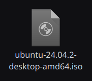
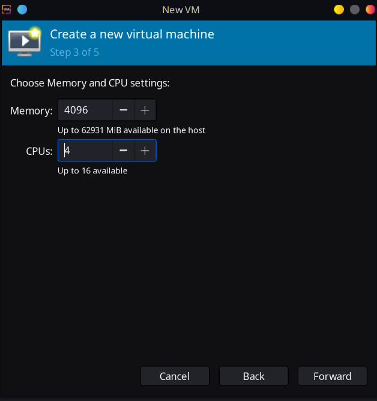
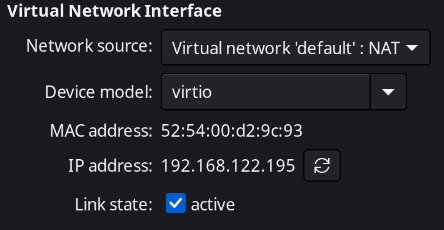
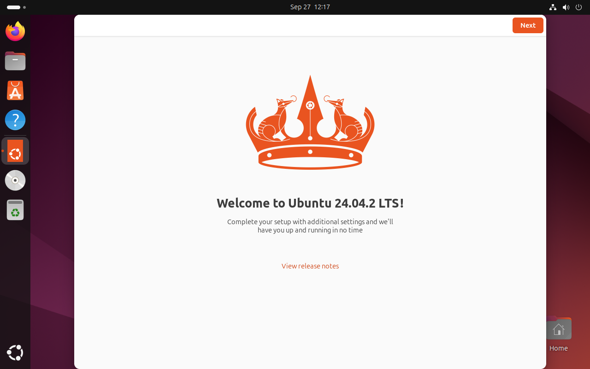

# Virtualisation & Linux Setup

Instead of VMWare or VirtualBox, I have decided to use a hypervisor I am more familiar with, Virtual Machine Manager which uses libvirt that runs on QEMU/KVM of my existing linux laptop.

I proceeded to install the ISO for Ubuntu 24.04 that was provided.

I allocated 4 cores and 4 GiB of memory to the Guest OS.

Network settings are VirtManager default, which is via NAT.

After running through the installation steps, I quickly had a working desktop.

