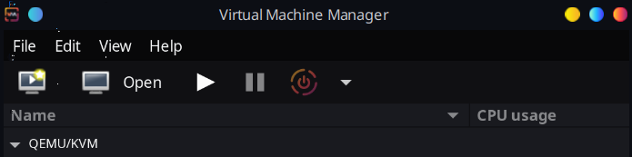

# Virtualization & Linux Setup

Instead of VMWare or VirtualBox, I have decided to use a hypervisor I am more familiar with, Virtual Machine Manager which uses libvirt that runs on QEMU/KVM of my existing linux laptop.

I proceeded to install the ISO for Ubuntu 24.04 that was provided.

I allocated 4 cores and 4 GiB of memory to the Guest OS.

Network settings are VirtManager default, which is via NAT.

After running through the installation steps, I quickly had a working desktop.

I was able to easily set up ssh access & gain a shell from the host machine into the guest.

## Reflections

- What are the advantages of using virtual machines for testing and development?
    - Virtual machines allow for multiple operating systems to run on a single machine. This can allow multiple services that require vastly different software and versions to run on the same device. This is further helped in cloud scenarios, allowing clients to reduce running costs down to an as-needed basis.
- What challenges did you face during installation or network setup?
    - There were no challenges during installation and network setup, all the defaults were sufficient.
- What are the differences between NAT and Bridged networking
    - NAT networking masquerades all packets from the guest OS to the host machine's network traffic.
    - Bridging will allow the guest OS to interact with the network directly through the same port as the host machine, without masquerading as the host.
- What did you learn about Linux distributions (distros)?
    - Effectively there are very few “root” Linux distributions. Most that use the same package manager are derivative from the distributions that develop the package manager itself. These derivative distributions are often made to fit specific niches. In the case of ubuntu, it is largely derived from Debian but has its own additions that allow it to fit a different use case, such as snap infrastructure and the usage of newer packages.
- How confident do you feel using Ubuntu after completing this lab?
    - My first Linux distribution was Kubuntu in a Virtual Machine. I am well familiarized to Ubuntu and the apt/dpkg package manager. I have been running Arch Linux as my main operating system for nearly 2 years now which has allowed me to gain familiarity with the various tools that apply for all Linux distributions.
- What would you do differently if setting up another VM?
    - I would likely use the server version of Ubuntu as it takes less system resources and storage to run.
