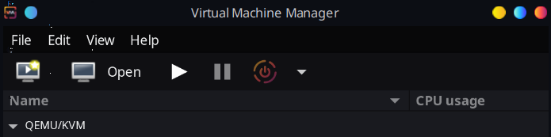

# Virtualisation & Linux Setup

Instead of VMWare or VirtualBox, I have decided to use a hypervisor I am more familiar with, Virtual Machine Manager which uses libvirt that runs on QEMU/KVM of my existing linux laptop.

