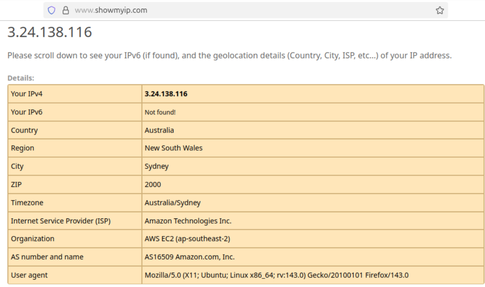

# Setting up Wireguard VPN

Wireguard VPN is a Virtual Private Network service. It can route packets through a VPN gateway often to access an intranet or as a gateway to the the wider internet, hiding the user's IP address. Wireguard is a modern, open source solution to this, and very configurable. In this case I will be setting up a point to site (P2S) VPN to connect via my virtual machine.

For sources, I used the the official wireguard website and [nixCraft](https://www.cyberciti.biz/faq/how-to-set-up-wireguard-firewall-rules-in-linux/) alongside the manual pages.

Before setting up the server I decided to make sure that I had the configuration files set up first.

I started by installing wireguard on my virtual machine with the following command.
```
hazoor@ICT171Labs:~$ sudo apt install wireguard
```

From reading the manual pages from `wg` and `wg-quick` I found that I needed to create some configuration files. These files were in the format of TOML files. For this, I created the following cheat sheet from the contents of the wireguard manual pages.
```
[Interface]
PrivateKey = <base64 private key generated by wg genkey. Required.>
ListenPort = <a 16-bit port for listening. Optional; if not specified, chosen randomly. Usually 51820>
FwMark = <32-bit fwmark for outgoing packets. If set to 0 or "off", this option is disabled. May be specified in hexadecimal by prepending "0x". Optional.>
Address = <a comma-separated list of IP (v4 or v6) addresses (optionally with CIDR masks) to be assigned to the interface. Maybe specified multiple times.>
DNS = <DNS a comma-separated list of IP (v4 or v6) addresses to be set as the interface's DNS servers, or non-IP hostnames to be set as the interface's DNS search domains. May be specified multiple times. Upon bringing the interface up, this runs `resolvconf -a tun.INTERFACE -m 0 -x` and upon bringing it down, this runs `resolvconf -d tun.INTERFACE`. If these particular invocations of resolvconf(8) are undesirable, the PostUp and PostDown keys below may be used instead.>
MTU = <if not specified, the MTU is automatically determined from the endpoint addresses or the system default route, which is usually a sane choice. However, to manually specify an MTU to override this automatic discovery, this value may be specified explicitly.>
Table = <Controls the routing table to which routes are added. There are two special values: `off' disables the creation of routes altogether, and `auto' (the default) adds routes to the default table and enables special handling of default routes.
PreUp, PostUp, PreDown, PostDown = script snippets which will be executed by bash(1) before/after setting up/tearing down the interface, most commonly used to configure custom DNS options or firewall rules. The special string `%i' is expanded to INTERFACE. Each one may be specified multiple times, in which case the commands are executed in order.>
SaveConfig = <if set to `true', the configuration is saved from the current state of the interface upon shutdown. Any changes made to the configuration file before the interface is removed will therefore be overwritten.>

[Peer]
PublicKey = <base64 public key calculated by wg pubkey from a private key, and usually transmitted out of band to the author of the configuration file. Required.>
PresharedKey = <a base64 preshared key generated by wg genpsk. Optional, and may be omitted. This option adds an additional layer of symmetric-key cryptography to be mixed into the already existing public-key cryptography, for post-quantum resistance.>
AllowedIPs = <a comma-separated list of IP (v4 or v6) addresses with CIDR masks from which incoming traffic for this peer is allowed and to which outgoing traffic for this peer is directed. The catch-all 0.0.0.0/0 may be specified for matching all IPv4 addresses, and ::/0 may be specified for matching all IPv6 addresses. May be specified multiple times.>
Endpoint = <an endpoint IP or hostname, followed by a colon, and then a port number. This endpoint will be updated automatically to the most recent source IP address and port of correctly authenticated packets from the peer. Optional.>
PersistentKeepalive = <a seconds interval, between 1 and 65535 inclusive, of how often to send an authenticated empty packet to the peer for the purpose of keeping a stateful firewall or NAT mapping valid persistently. For example, if the interface very rarely sends traffic, but it might at anytime receive traffic from a peer, and it is behind NAT, the interface might benefit from having a persistent keepalive interval of 25 seconds. If set to 0 or "off", this option is disabled. By default or when unspecified, this option is off. Most users will not need this. Optional.>
```

For the server, I created the following `server-wg0.conf` configuration file:
```toml
[Interface]
PrivateKey = 
ListenPort = 51820
Address = 10.4.12.1/24
SaveConfig = true

# Packet forwarding
PostUp = iptables -t nat -I POSTROUTING 1 -s 10.4.12.0/24 -o ens5 -j MASQUERADE; iptables -I INPUT 1 -i wg0 -j ACCEPT; iptables -I FORWARD 1 -i ens5 -o wg0 -j ACCEPT; iptables -I FORWARD 1 -i wg0 -o ens5 -j ACCEPT; iptables -I INPUT 1 -i ens5 -p udp --dport 51820 -j ACCEPT
PostDown = iptables -t nat -D POSTROUTING -s 10.4.12.0/24 -o ens5 -j MASQUERADE; iptables -D INPUT -i wg0 -j ACCEPT; iptables -D FORWARD -i ens5 -o wg0 -j ACCEPT; iptables -D FORWARD -i wg0 -o ens5 -j ACCEPT; iptables -D INPUT -i ens5 -p udp --dport 51820 -j ACCEPT


[Peer]
# Ubuntu VM
PublicKey = 
PresharedKey = 
AllowedIPs = 10.4.12.2/32
```

For the client, I created the following `client-wg0.conf`configuration file:
```toml
[Interface]
PrivateKey = 
Address = 10.4.12.2/24
DNS = 9.9.9.9, 149.112.112.112

[Peer]
PublicKey = 
PresharedKey = 
AllowedIPs = 0.0.0.0/0, ::0/0
Endpoint = www.hazoorpreet.com:51820
PersistentKeepalive = 25
```

From here I added a new security group to my cloud VM, allowing ports 80, 443, and 51820 so I could run both the apache2 web server and the VPN. I did not do away with the other security groups just yet as I would still need direct shell access for now.

I added the new group and started my instance, but realized a major flaw. The IP address for AWS would change every time I started my instance. This would have to be solved with DDNS. So I configured DDNS for my namecheap domain. For this, I started by gaining shell access into my AWS server

I installed ddclient and configured it to dynamically set the www host.

```
ubuntu@ip-172-31-3-194:~$ sudo apt install ddclient
ubuntu@ip-172-31-3-194:~$ sudo nano /etc/ddclient.conf 
ubuntu@ip-172-31-3-194:~$ sudo cat /etc/ddclient.conf 
# /etc/ddclient.conf

use=web \
web=dynamicdns.park-your-domain.com/getip \
protocol=namecheap \
server=dynamicdns.park-your-domain.com \
login=hazoorpreet.com \
password=[Redacted] \
www
```

I wanted this to run at reboot to make sure it updated every time I relaunched the instance, so I added the following line to `sudo crontab -e`
```
@reboot /usr/sbin/ddclient
```
After running `sudo ddclient` once, I checked namecheap and saw that it successfully updated

This would take care of DDNS, hopefully permanently.

I installed wireguard to the remote server and generated the keys.
```
ubuntu@ip-172-31-3-194:~$ sudo apt install wireguard
ubuntu@ip-172-31-3-194:~$ (umask 077; wg genkey > wgprivatekey)
ubuntu@ip-172-31-3-194:~$ cat wgprivatekey 
[Redacted for security]
ubuntu@ip-172-31-3-194:~$ wg pubkey < wgprivatekey > wgpublickey
ubuntu@ip-172-31-3-194:~$ cat wgpublickey 
[Redacted for security]
```

I proceeded to do generate the keys on my virtual machine, along with generating a pre-shared key.
```
hazoor@ICT171Labs:~$ (umask 077; wg genkey > wgprivatekey)
hazoor@ICT171Labs:~$ cat wgprivatekey 
[Redacted for security]
hazoor@ICT171Labs:~$ wg pubkey < wgprivatekey > wgpublickey
hazoor@ICT171Labs:~$ cat wgpublickey 
[Redacted for security]
hazoor@ICT171Labs:~$ (umask 077; wg genpsk > wgpresharedkey)
hazoor@ICT171Labs:~$ cat wgpresharedkey 
[Redacted for security]
```

I proceeded to fill out the key information and move `server-wg0.conf` over to the server
```
hazoor@ICT171Labs:~$ scp -i "HTTPS Web Server.pem" server-wg0.conf ubuntu@www.hazoorpreet.com:/home/ubuntu
server-wg0.conf                               100%  811     8.0KB/s   00:00
```

From the server, I copied this configuration to `/etc/wireguard/wg0.conf`
```
ubuntu@ip-172-31-3-194:~$ sudo cp server-wg0.conf /etc/wireguard/wg0.conf
```
I did the same on the virtual machine client
```
hazoor@ICT171Labs:~$ sudo cp client-wg0.conf /etc/wireguard/wg0.conf
```

Now, one more step needed to be done before this was ready. I needed to allow IPv4 routing on the server.
```
ubuntu@ip-172-31-3-194:~$ sudo nano /etc/sysctl.d/10-wireguard.conf
ubuntu@ip-172-31-3-194:~$ cat /etc/sysctl.d/10-wireguard.conf 
net.ipv4.ip_forward=1
ubuntu@ip-172-31-3-194:~$ sudo sysctl -p /etc/sysctl.d/10-wireguard.conf
net.ipv4.ip_forward = 1
```

I proceeded to start the server
```
ubuntu@ip-172-31-3-194:~$ sudo systemctl start wg-quick@wg0.service  \
ubuntu@ip-172-31-3-194:~$ sudo systemctl status wg-quick@wg0.service  \
● wg-quick@wg0.service - WireGuard via wg-quick(8) for wg0\
    Loaded: loaded (/usr/lib/systemd/system/wg-quick@.service; disabled; preset: enabled)\
    Active: active (exited) since Sun 2025-10-05 04:06:08 UTC; 11s ago\
      Docs: man:wg-quick(8)\
            man:wg(8)\
            https://www.wireguard.com/\
            https://www.wireguard.com/quickstart/\
            https://git.zx2c4.com/wireguard-tools/about/src/man/wg-quick.8\
            https://git.zx2c4.com/wireguard-tools/about/src/man/wg.8\
   Process: 1560 ExecStart=/usr/bin/wg-quick up wg0 (code=exited, status=0/SUCCESS)\
  Main PID: 1560 (code=exited, status=0/SUCCESS)\
       CPU: 68ms\
\
Oct 05 04:06:08 ip-172-31-3-194 systemd\[1]: Starting wg-quick@wg0.service - WireGuard via wg-quick(8) for wg0...\
Oct 05 04:06:08 ip-172-31-3-194 wg-quick\[1560]: \[#] ip link add wg0 type wireguard\
Oct 05 04:06:08 ip-172-31-3-194 wg-quick\[1560]: \[#] wg setconf wg0 /dev/fd/63\
Oct 05 04:06:08 ip-172-31-3-194 wg-quick\[1560]: \[#] ip -4 address add 10.4.12.1/24 dev wg0\
Oct 05 04:06:08 ip-172-31-3-194 wg-quick\[1560]: \[#] ip link set mtu 8921 up dev wg0\
Oct 05 04:06:08 ip-172-31-3-194 wg-quick\[1560]: \[#] iptables -t nat -I POSTROUTING 1 -s 10.4.12.0/24 -o ens5 -j MASQUERADE; iptables -I INPUT 1 -i wg0 -j ACCEPT; iptab>\
Oct 05 04:06:08 ip-172-31-3-194 systemd\[1]: Finished wg-quick@wg0.service - WireGuard via wg-quick(8) for wg0.\
ubuntu@ip-172-31-3-194:~$ sudo wg\
interface: wg0\
 public key: sh5FswXK4QbIZyB9ZAKjlM+MbTSz6gllrNn7hmGUogM=\
 private key: (hidden)\
 listening port: 51820\
\
peer: HiwYJpHorwUFHWQ/ynbgkViRJbcA/kkYySmM1ZV0T30=\
 preshared key: (hidden)\
 allowed ips: 10.4.12.2/32\
ubuntu@ip-172-31-3-194:~$ ip a\
1: lo: \<LOOPBACK,UP,LOWER\_UP> mtu 65536 qdisc noqueue state UNKNOWN group default qlen 1000\
   link/loopback 00:00:00:00:00:00 brd 00:00:00:00:00:00\
   inet 127.0.0.1/8 scope host lo\
      valid\_lft forever preferred\_lft forever\
   inet6 ::1/128 scope host noprefixroute  \
      valid\_lft forever preferred\_lft forever\
2: ens5: \<BROADCAST,MULTICAST,UP,LOWER\_UP> mtu 9001 qdisc mq state UP group default qlen 1000\
   link/ether 02:fd:18:32:ed:17 brd ff:ff:ff:ff:ff:ff\
   inet 172.31.3.194/20 metric 100 brd 172.31.15.255 scope global dynamic ens5\
      valid\_lft 2663sec preferred\_lft 2663sec\
   inet6 fe80::fd:18ff:fe32:ed17/64 scope link  \
      valid\_lft forever preferred\_lft forever\
6: wg0: \<POINTOPOINT,NOARP,UP,LOWER\_UP> mtu 8921 qdisc noqueue state UNKNOWN group default qlen 1000\
   link/none  \
   inet 10.4.12.1/24 scope global wg0\
      valid\_lft forever preferred\_lft forever
```

The server end was running. Now it was time to start the client.
```
hazoor@ICT171Labs:~$ sudo systemctl start wg-quick@wg0.service
hazoor@ICT171Labs:~$ sudo systemctl status wg-quick@wg0.service
\u25cf wg-quick@wg0.service - WireGuard via wg-quick(8) for wg0
     Loaded: loaded (/usr/lib/systemd/system/wg-quick@.service; disabled; preset: enabled)
     Active: active (exited) since Sun 2025-10-05 12:07:47 +08; 7s ago
       Docs: man:wg-quick(8)
             man:wg(8)
             https://www.wireguard.com/
             https://www.wireguard.com/quickstart/
             https://git.zx2c4.com/wireguard-tools/about/src/man/wg-quick.8
             https://git.zx2c4.com/wireguard-tools/about/src/man/wg.8
    Process: 7990 ExecStart=/usr/bin/wg-quick up wg0 (code=exited, status=0/SUCCESS)
   Main PID: 7990 (code=exited, status=0/SUCCESS)
        CPU: 56ms

Oct 05 12:07:47 ICT171Labs wg-quick[7990]: [#] ip -6 rule add not fwmark 51820 table 51820
Oct 05 12:07:47 ICT171Labs wg-quick[7990]: [#] ip -6 rule add table main suppress_prefixlength 0
Oct 05 12:07:47 ICT171Labs wg-quick[7990]: [#] ip -6 route add ::/0 dev wg0 table 51820
Oct 05 12:07:47 ICT171Labs wg-quick[7990]: [#] nft -f /dev/fd/63
Oct 05 12:07:47 ICT171Labs wg-quick[7990]: [#] ip -4 rule add not fwmark 51820 table 51820
Oct 05 12:07:47 ICT171Labs wg-quick[7990]: [#] ip -4 rule add table main suppress_prefixlength 0
Oct 05 12:07:47 ICT171Labs wg-quick[7990]: [#] ip -4 route add 0.0.0.0/0 dev wg0 table 51820
Oct 05 12:07:47 ICT171Labs wg-quick[7990]: [#] sysctl -q net.ipv4.conf.all.src_valid_mark=1
Oct 05 12:07:47 ICT171Labs wg-quick[7990]: [#] nft -f /dev/fd/63
Oct 05 12:07:47 ICT171Labs systemd[1]: Finished wg-quick@wg0.service - WireGuard via wg-quick(8) for wg0.
hazoor@ICT171Labs:~$ sudo wg
interface: wg0
  public key: HiwYJpHorwUFHWQ/ynbgkViRJbcA/kkYySmM1ZV0T30=
  private key: (hidden)
  listening port: 44290
  fwmark: 0xca6c

peer: sh5FswXK4QbIZyB9ZAKjlM+MbTSz6gllrNn7hmGUogM=
  preshared key: (hidden)
  endpoint: 13.211.162.160:51820
  allowed ips: 0.0.0.0/0, ::/0
  latest handshake: 14 seconds ago
  transfer: 508 B received, 596 B sent
  persistent keepalive: every 25 seconds
hazoor@ICT171Labs:~$ ip a
1: lo: <LOOPBACK,UP,LOWER_UP> mtu 65536 qdisc noqueue state UNKNOWN group default qlen 1000
    link/loopback 00:00:00:00:00:00 brd 00:00:00:00:00:00
    inet 127.0.0.1/8 scope host lo
       valid_lft forever preferred_lft forever
    inet6 ::1/128 scope host noprefixroute 
       valid_lft forever preferred_lft forever
2: enp1s0: <BROADCAST,MULTICAST,UP,LOWER_UP> mtu 1500 qdisc fq_codel state UP group default qlen 1000
    link/ether 52:54:00:d2:9c:93 brd ff:ff:ff:ff:ff:ff
    inet 192.168.122.195/24 brd 192.168.122.255 scope global dynamic noprefixroute enp1s0
       valid_lft 3412sec preferred_lft 3412sec
    inet6 fe80::5054:ff:fed2:9c93/64 scope link 
       valid_lft forever preferred_lft forever
10: wg0: <POINTOPOINT,NOARP,UP,LOWER_UP> mtu 1420 qdisc noqueue state UNKNOWN group default qlen 1000
    link/none 
    inet 10.4.12.2/24 scope global wg0
       valid_lft forever preferred_lft forever
```

I checked my IP address, to see what it would show. I clearly had network connectivity and could see that the IP shown was the same as my server, even showing Amazon EC2 as the organization.


I tested shell access through the VPN. This was a clear success.
```
hazoor@ICT171Labs:~$ ssh -i "HTTPS Web Server.pem" ubuntu@10.4.12.1
The authenticity of host '10.4.12.1 (10.4.12.1)' can't be established.
ED25519 key fingerprint is SHA256:sKfchVfvKd04LAiPR/v4IhHJKPY0xiQpZbwzji+28yY.
This host key is known by the following other names/addresses:
    ~/.ssh/known_hosts:4: [hashed name]
    ~/.ssh/known_hosts:7: [hashed name]
    ~/.ssh/known_hosts:8: [hashed name]
Are you sure you want to continue connecting (yes/no/[fingerprint])? yes
Warning: Permanently added '10.4.12.1' (ED25519) to the list of known hosts.
Welcome to Ubuntu 24.04.3 LTS (GNU/Linux 6.14.0-1014-aws x86_64)

 * Documentation:  https://help.ubuntu.com
 * Management:     https://landscape.canonical.com
 * Support:        https://ubuntu.com/pro

 System information as of Sun Oct  5 04:13:25 UTC 2025

  System load:  0.01              Temperature:           -273.1 C
  Usage of /:   37.1% of 6.71GB   Processes:             121
  Memory usage: 25%               Users logged in:       1
  Swap usage:   0%                IPv4 address for ens5: 172.31.3.194


Expanded Security Maintenance for Applications is not enabled.

0 updates can be applied immediately.

Enable ESM Apps to receive additional future security updates.
See https://ubuntu.com/esm or run: sudo pro status


Last login: Sun Oct  5 03:51:20 2025 from [Redacted]
ubuntu@ip-172-31-3-194:~$ 
```

But there was one last thing to try. I disabled my other security groups, so ssh would not be accessible and ran a scan.
```
hazoor@ICT171Labs:~$ nmap www.hazoorpreet.com
Starting Nmap 7.94SVN ( https://nmap.org ) at 2025-10-05 12:18 +08
Nmap scan report for www.hazoorpreet.com (13.211.162.160)
Host is up (0.11s latency).
rDNS record for 13.211.162.160: ec2-13-211-162-160.ap-southeast-2.compute.amazonaws.com
Not shown: 998 filtered tcp ports (no-response)
PORT    STATE SERVICE
80/tcp  open  http
443/tcp open  https

Nmap done: 1 IP address (1 host up) scanned in 17.04 seconds
```

Only two ports seemed to be open, so I explicitly scanned the wireguard port
```
hazoor@ICT171Labs:~$ nmap -p 51820 www.hazoorpreet.com
Starting Nmap 7.94SVN ( https://nmap.org ) at 2025-10-05 12:19 +08
Nmap scan report for www.hazoorpreet.com (13.211.162.160)
Host is up (0.24s latency).
rDNS record for 13.211.162.160: ec2-13-211-162-160.ap-southeast-2.compute.amazonaws.com

PORT      STATE    SERVICE
51820/tcp filtered unknown

Nmap done: 1 IP address (1 host up) scanned in 2.72 seconds
```

It didn't show as opened, at least not to an nmap scan, so I tried to connect to the vpn anyways and see if I could ping 8.8.8.8.
```
hazoor@ICT171Labs:~$ sudo systemctl start wg-quick@wg0.service
hazoor@ICT171Labs:~$ ping 8.8.8.8
PING 8.8.8.8 (8.8.8.8) 56(84) bytes of data.
64 bytes from 8.8.8.8: icmp_seq=1 ttl=118 time=361 ms
64 bytes from 8.8.8.8: icmp_seq=2 ttl=118 time=142 ms
64 bytes from 8.8.8.8: icmp_seq=3 ttl=118 time=367 ms
^C
--- 8.8.8.8 ping statistics ---
3 packets transmitted, 3 received, 0% packet loss, time 2003ms
rtt min/avg/max/mdev = 141.505/289.813/367.408/104.907 ms
```

With this successful, I tried to see if I could gain shell access to my server through the VPN even if port 22 was not open on the outside.
```
hazoor@ICT171Labs:~$ sudo ssh -i "HTTPS Web Server.pem" ubuntu@10.4.12.1
The authenticity of host '10.4.12.1 (10.4.12.1)' can't be established.
ED25519 key fingerprint is SHA256:sKfchVfvKd04LAiPR/v4IhHJKPY0xiQpZbwzji+28yY.
This key is not known by any other names.
Are you sure you want to continue connecting (yes/no/[fingerprint])? yes
Warning: Permanently added '10.4.12.1' (ED25519) to the list of known hosts.
Welcome to Ubuntu 24.04.3 LTS (GNU/Linux 6.14.0-1014-aws x86_64)

 * Documentation:  https://help.ubuntu.com
 * Management:     https://landscape.canonical.com
 * Support:        https://ubuntu.com/pro

 System information as of Sun Oct  5 04:23:38 UTC 2025

  System load:  0.0               Temperature:           -273.1 C
  Usage of /:   37.1% of 6.71GB   Processes:             121
  Memory usage: 27%               Users logged in:       1
  Swap usage:   0%                IPv4 address for ens5: 172.31.3.194


Expanded Security Maintenance for Applications is not enabled.

0 updates can be applied immediately.

Enable ESM Apps to receive additional future security updates.
See https://ubuntu.com/esm or run: sudo pro status


Last login: Sun Oct  5 04:13:25 2025 from 10.4.12.2
ubuntu@ip-172-31-3-194:~$ 
```

Now, with with the help of the VPN, I did not have to expose port 22 to attackers, and could instead connect through a Wireguard tunnel. I could also mask my own IP address when accessing the internet.

Finally, to make sure this would all run at startup, I enabled the service.
```
ubuntu@ip-172-31-3-194:~$ sudo systemctl enable wg-quick@wg0.service
Created symlink /etc/systemd/system/multi-user.target.wants/wg-quick@wg0.service \u2192 /usr/lib/systemd/system/wg-quick@.service.
```

I stopped and restarted the server to make sure everything would run smoothly at startup. To note, the current IP before restart was `13.211.162.160`. Hopefully this would change and `ddclient` would be able to account for it on startup, then I would be able to connect via the automatically started wireguard service.

After the restart, the IP changed to `3.24.138.116`. I checked my dashboard for namecheap, it seemed to show the new IP address, but I had to wait for it to propagate.
I tried nslookup a few times until I saw the correct IP.
```
hazoor@ICT171Labs:~$ nslookup www.hazoorpreet.com
Server:		127.0.0.53
Address:	127.0.0.53#53

Non-authoritative answer:
Name:	www.hazoorpreet.com
Address: 13.211.162.160

hazoor@ICT171Labs:~$ nslookup www.hazoorpreet.com
Server:		127.0.0.53
Address:	127.0.0.53#53

Non-authoritative answer:
Name:	www.hazoorpreet.com
Address: 3.24.138.116
```

I then proceeded to attempt connection via VPN and check my IP address
```
hazoor@ICT171Labs:~$ sudo systemctl start wg-quick@wg0.service
```


Both the DDNS and VPN service successfully started automatically and allowed me to use the VPN. This experiment was fully successful.